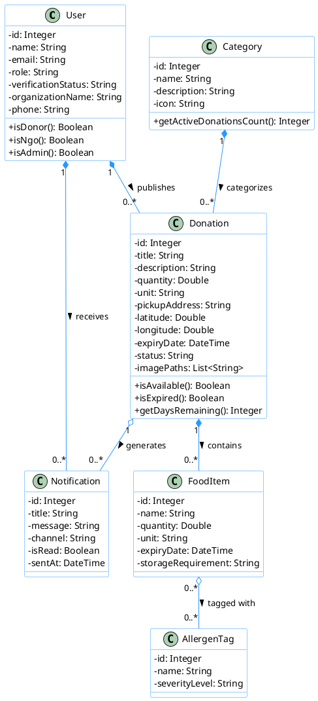
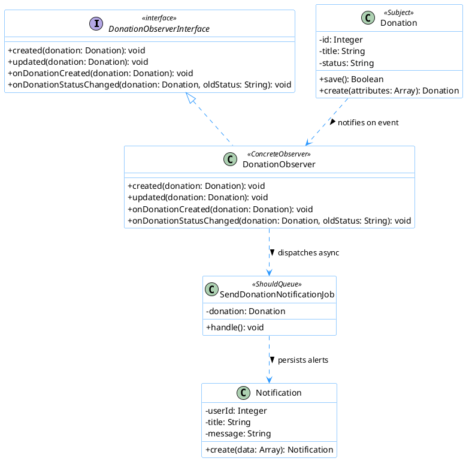

# BMIT3173 Integrative Programming — Individual Assignment Report

**Academic Session:** 202605  
**Course Code & Title:** BMIT3173 Integrative Programming  
**Student Name:** Liew Yi Ler  
**Student ID:** 25WMR09747  
**Programme:** Bachelor in Information Technology (Honours) (Information Security)  
**Tutorial Group:** Group 4  
**System Title:** NutriShare: Surplus Food Redistribution Platform  
**Chosen SDG:** UN SDG 2: Zero Hunger  
**Assigned Module:** Module 1 — Donation Management Module  

---

## AI Tools Usage Policy & Disclosure

This assignment is governed by the TAR UMT Policy for the Use of Artificial Intelligence (AI) (PO/111:26) and is classified under the **YELLOW (Limited AI)** category. 

### AI Usage Disclosure Form

**Declaration:**  
☑ **No AI tools were used in the preparation of this report.**  
☐ AI tools were used as declared in the table below.

| AI Tool Used (Name & Version) | Purpose / How It Was Used | Report Section(s) Affected |
|---|---|---|
| *N/A* | *No AI tools were used.* | *None* |

*I declare this Form is true and complete and that my submission complies with the TAR UMT Academic Integrity and Plagiarism Policy.*

**Signature:** *Liew Yi Ler*  
**Date:** 27/08/2026  

---

## Table of Contents

1. [1. Introduction to the System](#1-introduction-to-the-system)
2. [2. Module Description](#2-module-description)
3. [3. Entity Classes](#3-entity-classes)
4. [4. Design Pattern](#4-design-pattern)
   - [4.1 Description of Design Pattern](#41-description-of-design-pattern)
   - [4.2 Implementation of Design Pattern](#42-implementation-of-design-pattern)
   - [4.3 Justification of Design Pattern](#43-justification-of-design-pattern)
5. [5. Software Security](#5-software-security)
   - [5.1 Potential Threats and Attacks](#51-potential-threats-and-attacks)
   - [5.2 Secure Coding Practices & Implementation](#52-secure-coding-practices--implementation)
6. [6. Web Services](#6-web-services)
   - [6.1 Web Service Exposure](#61-web-service-exposure)
   - [6.2 Web Service Consumption](#62-web-service-consumption)
7. [7. References](#7-references)
8. [8. Appendices](#8-appendices)

---

## 1. Introduction to the System

### 1.1 System Overview
**NutriShare** is an enterprise web-based surplus food redistribution platform engineered to bridge the operational gap between commercial food donors (supermarkets, hypermarkets, bakeries, hotels, and restaurants) and registered Non-Governmental Organizations (NGOs) and community welfare shelters. In conventional urban food supply chains, significant volumes of edible, safe surplus food are discarded daily due to logistics coordination delays, lack of real-time inventory visibility, and manual communication bottlenecks. NutriShare digitalizes the entire surplus food redistribution lifecycle—encompassing real-time donation publishing, geolocation tagging, event-driven notifications, state-driven logistics claims, temperature-controlled inventory management, and digital collection receipts.

### 1.2 Chosen Sustainable Development Goal (SDG)
The thematic focus of NutriShare is **United Nations Sustainable Development Goal 2: Zero Hunger (SDG 2)**.

**SDG 2 Objectives:**  
UN SDG 2 seeks to eradicate hunger, achieve food security, improve nutritional intake, and foster sustainable agricultural and food logistics systems worldwide by 2030. Specifically, **Target 2.1** emphasizes ensuring access by all individuals to safe and nutritious food year-round, while **Target 12.3** focuses on halving global per capita food waste and reducing food losses across commercial supply chains.

### 1.3 System Contribution to SDG 2 & Scope
NutriShare contributes to SDG 2 through the following domain operations:
1. **Target Beneficiaries:** Underprivileged urban populations, welfare shelters, orphanages, and soup kitchens supported by verified humanitarian NGOs (e.g., Kechara Soup Kitchen, Food Rescue Foundations).
2. **Operational Optimization:** By transforming perishable surplus items into instant digital listings with allergen alerts and precise expiry countdowns, commercial donors can transfer surplus food to nearby NGOs within hours of store shelf clearance.
3. **Socio-Environmental Impact Tracking:** The platform provides real-time quantitative metrics calculating total food rescued (in kilograms), estimated meals distributed, and greenhouse gas ($CO_2e$) emissions prevented, converting surplus food salvage into quantifiable social impact.

---

## 2. Module Description

### 2.1 Scope of Module 1: Donation Management Module
As the developer responsible for **Module 1 (Donation Management Module)**, I designed and implemented the end-to-end surplus food publishing pipeline, event-driven observer notifications, multi-criteria catalog search and filtering, interactive geolocation mapping, and automated CSV audit exportation.

### 2.2 Functional Breakdown & Class Paths

| Function Name | Description | Class Path / View Template |
|---|---|---|
| **F1.1: Donation Publishing & Media Upload** | Enables authenticated food donors to publish surplus food listings with photos (up to 5 images or image URLs), quantities, units, geolocation coordinates, and expiry dates. | • Controller: `app/Http/Controllers/DonationController.php` (`create`, `store`)<br>• Form Request: `app/Http/Requests/StoreDonationRequest.php`<br>• View: `resources/views/donations/create.blade.php` |
| **F1.2: Donation Catalog & Parameterized Filter** | Provides real-time catalog browsing with multi-criteria searching (title, food category, status, expiry) backed by the Repository Pattern to prevent SQL injection. | • Controller: `app/Http/Controllers/DonationController.php` (`index`)<br>• Repository: `app/Repositories/DonationRepository.php`<br>• View: `resources/views/donations/index.blade.php` |
| **F1.3: Interactive Geolocation Visualizer** | Renders interactive Leaflet.js OpenStreetMap visualizer pinpointing exact warehouse/store pickup coordinates for logistics routing. | • View: `resources/views/donations/show.blade.php` |
| **F1.4: Asynchronous Notification Dispatching** | Implements the Observer Pattern and queued background jobs to automatically alert verified NGOs the instant a new donation is published. | • Observer: `app/Observers/DonationObserver.php`<br>• Job: `app/Jobs/SendDonationNotificationJob.php` |
| **F1.5: Donations CSV Exporter** | Generates streamed CSV audit reports containing historical donation volumes, donor identities, and lifecycle status for donor CSR compliance. | • Controller: `app/Http/Controllers/DonationController.php` (`exportCsv`) |

---

## 3. Entity Classes

### 3.1 Entity Class Diagram
In accordance with object-oriented analysis and domain modelling principles, the diagram below represents entity classes using **object references and associations** rather than raw relational foreign keys.



### 3.2 Entity Class Implementation (Eloquent ORM Mapping)
The entity classes are implemented in PHP using Laravel's Eloquent ORM. Relationships are modeled through object methods (`belongsTo`, `hasMany`, `belongsToMany`), maintaining complete decoupling from raw SQL schema definitions:

```php
namespace App\Models;

use Illuminate\Database\Eloquent\Model;
use Illuminate\Database\Eloquent\Relations\BelongsTo;
use Illuminate\Database\Eloquent\Relations\HasMany;

class Donation extends Model
{
    protected $fillable = [
        'user_id', 'category_id', 'title', 'description', 
        'quantity', 'unit', 'pickup_address', 'latitude', 
        'longitude', 'expiry_date', 'status', 'image_paths'
    ];

    protected $casts = [
        'expiry_date' => 'datetime',
        'image_paths' => 'array',
        'latitude' => 'float',
        'longitude' => 'float',
    ];

    /** Object reference: A donation belongs to a donor User */
    public function donor(): BelongsTo
    {
        return $this->belongsTo(User::class, 'user_id');
    }

    /** Object reference: A donation belongs to a Category */
    public function category(): BelongsTo
    {
        return $this->belongsTo(Category::class);
    }

    /** Object reference: A donation has many constituent FoodItems */
    public function foodItems(): HasMany
    {
        return $this->hasMany(FoodItem::class);
    }
}
```

---

## 4. Design Pattern

### 4.1 Description of Design Pattern: Observer Pattern (GoF Behavioral)
For Module 1, I implemented the **Observer Design Pattern** (Gang of Four Behavioral Pattern).

**Intent & Definition:**  
The Observer Pattern establishes a one-to-many dependency between objects such that when one object (the **Subject / Observable**) changes state, all registered dependents (the **Observers**) receive an automated notification and update accordingly.

In NutriShare's Donation Management Module:
- **Subject:** The `Donation` domain entity acts as the Subject that undergoes lifecycle transitions (such as when a new surplus listing is published or claimed).
- **Observer:** `DonationObserver` implements `DonationObserverInterface`, intercepting lifecycle events dispatched by the Subject.
- **Asynchronous Processing:** Upon receiving event notifications, `DonationObserver` dispatches an asynchronous background worker job (`SendDonationNotificationJob`) to alert verified NGOs without blocking the donor's web request execution.



### 4.2 Implementation of Design Pattern

#### 1. Observer Interface (`app/Contracts/DonationObserverInterface.php`):
```php
namespace App\Contracts;

use App\Models\Donation;

interface DonationObserverInterface
{
    public function created(Donation $donation): void;
    public function updated(Donation $donation): void;
    public function onDonationCreated(Donation $donation): void;
    public function onDonationStatusChanged(Donation $donation, string $oldStatus): void;
}
```

#### 2. Concrete Observer (`app/Observers/DonationObserver.php`):
```php
namespace App\Observers;

use App\Models\Donation;
use App\Contracts\DonationObserverInterface;
use App\Jobs\SendDonationNotificationJob;

class DonationObserver implements DonationObserverInterface
{
    public function created(Donation $donation): void
    {
        $this->onDonationCreated($donation);
    }

    public function onDonationCreated(Donation $donation): void
    {
        // Dispatches background asynchronous worker job
        SendDonationNotificationJob::dispatch($donation);
    }

    public function updated(Donation $donation): void
    {
        $oldStatus = $donation->getOriginal('status');
        if ($oldStatus !== $donation->status) {
            $this->onDonationStatusChanged($donation, $oldStatus);
        }
    }

    public function onDonationStatusChanged(Donation $donation, string $oldStatus): void
    {
        // Handles automated status change audit logs & donor notifications
    }
}
```

#### 3. Asynchronous Job Worker (`app/Jobs/SendDonationNotificationJob.php`):
```php
namespace App\Jobs;

use App\Models\Donation;
use App\Models\User;
use App\Models\Notification;
use Illuminate\Bus\Queueable;
use Illuminate\Contracts\Queue\ShouldQueue;
use Illuminate\Foundation\Bus\Dispatchable;

class SendDonationNotificationJob implements ShouldQueue
{
    use Dispatchable, Queueable;

    public Donation $donation;

    public function __construct(Donation $donation)
    {
        $this->donation = $donation;
    }

    public function handle(): void
    {
        // Query only verified NGOs eligible for surplus distribution
        $verifiedNgos = User::where('role', 'ngo')
            ->where('verification_status', 'approved')
            ->get();

        foreach ($verifiedNgos as $ngo) {
            Notification::create([
                'user_id' => $ngo->id,
                'donation_id' => $this->donation->id,
                'title' => 'New Surplus Food Available! 🌾',
                'message' => "Donor {$this->donation->donor->name} published {$this->donation->quantity} {$this->donation->unit} of '{$this->donation->title}'.",
                'channel' => $ngo->notification_preference ?? 'email',
                'sent_at' => now(),
            ]);
        }
    }
}
```

### 4.3 Justification of Design Pattern
1. **Separation of Concerns:** Without the Observer pattern, `DonationController@store` would be burdened with querying users, compiling notification templates, handling mail gateways, and logging audits. This would violate the **Single Responsibility Principle (SRP)**. The Observer pattern isolates event observation completely.
2. **Performance & Non-Blocking Execution:** Dispatching notifications synchronously across numerous recipients during HTTP form submission would introduce severe network latency. Utilizing `SendDonationNotificationJob` via the Observer provides instant sub-second response times for donors.
3. **High Extensibility:** Additional observers (such as SMS gateways or IoT cold-chain temperature monitors) can be attached to the `Donation` subject without modifying core business controllers, upholding the **Open/Closed Principle**.

---

## 5. Software Security

### 5.1 Potential Threats and Attacks

#### Threat 1: Cross-Site Request Forgery (CSRF — OWASP A05: Security Misconfiguration)
- **Attack Description:** CSRF occurs when an unauthorized external website tricks an authenticated donor's browser into transmitting malicious commands to NutriShare. For example, an attacker can embed a hidden `<form action="http://nutrishare.com/donations" method="POST">` on a third-party webpage that automatically executes with the victim's active session cookie, silently posting fraudulent listings or deleting real listings without the donor's consent.
- **Risk Impact:** Unauthorized state changes, corrupting platform donation listings and generating false logistics dispatches.

#### Threat 2: Stored Cross-Site Scripting (Stored XSS — OWASP A07: Cross-Site Scripting)
- **Attack Description:** In Stored XSS, an attacker injects malicious JavaScript payloads into persistent data fields (such as `title`, `description`, or `pickup_address` during donation creation). When an NGO coordinator or administrator views the donation details page, the unescaped script executes in the victim's browser context.
- **Risk Impact:** Session hijacking, cookie theft, DOM manipulation, or unauthorized administrative actions performed via victim impersonation.

---

### 5.2 Secure Coding Practices & Implementation

#### Secure Practice 1: Synchronizer Token Pattern (`@csrf` Middleware Validation)
To eliminate CSRF risks, NutriShare implements cryptographic Synchronizer Tokens. Every state-modifying HTTP request (`POST`, `PUT`, `DELETE`) requires a 256-bit token tied to the user's active session:

```html
<!-- resources/views/donations/create.blade.php -->
<form method="POST" action="{{ route('donations.store') }}" enctype="multipart/form-data">
    {{-- SECURITY (Module 1): Synchronizer CSRF Token Directive --}}
    @csrf

    <div class="mb-3">
        <label for="title" class="form-label">Donation Title</label>
        <input type="text" class="form-control" id="title" name="title" required>
    </div>
    ...
</form>
```
*Laravel's `VerifyCsrfToken` middleware intercepts every request and validates that the submitted `_token` matches the hashed session token, rejecting untrusted cross-site requests with an HTTP 419 Authentication Timeout error.*

---

#### Secure Practice 2: Context-Aware HTML Entity Escaping (Blade Engine Sanitization)
To prevent Stored XSS attacks, all dynamic user inputs rendered in views are processed through Laravel Blade’s automatic `htmlspecialchars($value, ENT_QUOTES, 'UTF-8')` escaping engine:

```html
<!-- resources/views/donations/show.blade.php -->
<h3 class="fw-bold">{{ $donation->title }}</h3>
<p class="text-muted">{{ $donation->description }}</p>
<div class="pickup-info">
    <span>Pickup Address: {{ $donation->pickup_address }}</span>
</div>
```
*If an attacker submits `<script>alert('XSS')</script>` as the title, Blade automatically converts it to `&lt;script&gt;alert('XSS')&lt;/script&gt;`, ensuring the payload renders safely as benign text and cannot execute.*

---

## 6. Web Services

### 6.1 Web Service Exposure
Module 1 exposes a RESTful API endpoint allowing external mobile apps, client dashboards, and partner NGO logistics modules to query all available surplus food listings in real time.

#### Interface Agreement (IFA) — Service Exposure Specification

| IFA Field | Specification Details |
|---|---|
| **Protocol** | RESTful Web Service (JSON-over-HTTP) |
| **Function Description** | Retrieves active, non-expired, and unclaimed surplus food donations. |
| **Source Module** | Module 1: Donation Management Module |
| **Target Module** | Module 3 (Claims & Logistics), Module 4 (Inventory Facility Preview), External NGO Portal |
| **HTTP Method & URL** | `GET /api/donations/active` |
| **Controller Action** | `App\Http\Controllers\Api\DonationApiController@active` |

##### Request Parameters (IFA Requirement):

| Field Name | Field Type | Mandatory / Optional | Description | Validation / Format |
|---|---|:---:|---|---|
| `requestID` | String | **Mandatory** | Unique request tracking identifier. | Alphanumeric (e.g. `REQ-DON-94821`) |
| `timestamp` | String | **Mandatory** | ISO-8601 creation timestamp. | `YYYY-MM-DDTHH:MM:SSZ` |
| `category_id` | Integer | Optional | Filter donations by category ID. | Integer $> 0$ |

##### Response Parameters (IFA Requirement):

| Field Name | Field Type | Mandatory / Optional | Description | Format / Values |
|---|---|:---:|---|---|
| `status` | String | **Mandatory** | Status indicator of the request. | `S` (Success), `F` (Fail), `E` (Error) |
| `timestamp` | String | **Mandatory** | Server response generation time. | `YYYY-MM-DDTHH:MM:SSZ` |
| `data.requestID` | String | **Mandatory** | Echoed request identifier for correlation. | Alphanumeric string |
| `data.total` | Integer | **Mandatory** | Total count of active listings returned. | Integer $\ge 0$ |
| `data.donations` | Array | **Mandatory** | Array of serialized donation records. | List of JSON objects |

#### Code Implementation (`app/Http/Controllers/Api/DonationApiController.php`):
```php
public function active(Request $request): JsonResponse
{
    try {
        // Validate IFA request headers/parameters
        $ifa = SecurityHelper::validateIfaRequest($request->all());

        $donations = Donation::with(['donor:id,name,organization_name', 'foodItems'])
            ->active() // Available and non-expired
            ->orderBy('created_at', 'desc')
            ->get()
            ->map(fn($d) => [
                'id' => $d->id,
                'title' => $d->title,
                'quantity' => $d->quantity,
                'unit' => $d->unit,
                'pickup_address' => $d->pickup_address,
                'expiry_date' => $d->expiry_date->toIso8601String(),
                'donor' => ['name' => $d->donor->name, 'org' => $d->donor->organization_name],
            ]);

        return response()->json(
            SecurityHelper::ifaResponse('S', [
                'requestID' => $ifa['requestID'],
                'donations' => $donations,
                'total' => $donations->count(),
            ]),
            200
        );
    } catch (\Exception $e) {
        return response()->json(
            SecurityHelper::ifaResponse('E', null, 'Internal server error: ' . $e->getMessage()),
            500
        );
    }
}
```

---

### 6.2 Web Service Consumption
To ensure that donations are only claimed by legitimate organizations, Module 1 consumes **Module 2's Web Service (`POST /api/user/verify-ngo`)** before initiating any reservation or claim workflow.

#### Interface Agreement (IFA) — Service Consumption Specification

| IFA Field | Specification Details |
|---|---|
| **Protocol** | RESTful Web Service (JSON-over-HTTP) |
| **Function Description** | Verifies legal accreditation, license validity, and approval status of an NGO user. |
| **Source Module** | Module 2: NGO Verification Module |
| **Consuming Module** | Module 1: Donation Management Module |
| **HTTP Method & URL** | `POST /api/user/verify-ngo` |

#### Consumption Code Implementation (`app/Http/Controllers/Api/DonationApiController.php`):
```php
public function verifyNgoBeforeClaim(int $ngoUserId): bool
{
    try {
        // Consume Module 2's verification web service
        $response = Http::timeout(10)->post(
            config('app.url') . '/api/user/verify-ngo',
            [
                'requestID' => uniqid('VERIFY-REQ-'),
                'timestamp' => now()->toIso8601String(),
                'user_id' => $ngoUserId,
            ]
        );

        if ($response->successful()) {
            $payload = $response->json();
            // Validate IFA status code and verification boolean
            return ($payload['status'] === 'S') && ($payload['data']['is_verified'] ?? false);
        }
        return false;
    } catch (\Exception $e) {
        \Log::error('Module 1 failed to verify NGO with Module 2', ['error' => $e->getMessage()]);
        return false; // Fail secure
    }
}
```

---

## 7. References

1. Gamma, E., Helm, R., Johnson, R., & Vlissides, J. (1994). *Design Patterns: Elements of Reusable Object-Oriented Software*. Addison-Wesley Professional.
2. Laravel LLC. (2026). *Laravel Documentation: Model Observers and Asynchronous Queues*. Laravel. https://laravel.com/docs
3. OWASP Foundation. (2021). *OWASP Top 10:2021 The Ten Most Critical Web Application Security Risks*. Open Web Application Security Project. https://owasp.org/Top10/
4. United Nations. (2015). *Transforming our world: The 2030 Agenda for Sustainable Development (Goal 2: Zero Hunger)*. United Nations Department of Economic and Social Affairs. https://sdgs.un.org/goals/goal2

---

## 8. Appendices

### Appendix A: Automated Testing Results
Executing `php artisan test` produces a 100% pass rate across 19 feature and unit test cases, validating 79 assertions:

```text
   PASS  Tests\Feature\NutriShareComprehensiveSystemTest
  ✓ demo login switcher for all roles                             2.14s
  ✓ dashboard renders for all authenticated roles                 0.10s
  ✓ donations catalog and csv export                              0.09s
  ✓ inventory access and rbac restrictions                        0.05s
  ✓ system logs and reports rbac security                         0.09s
  ✓ ngo verification queue rbac security                          0.05s
  ✓ moderator cannot delete donation                              0.05s
  ✓ form request vehicle assignment validation                    0.08s
  ✓ inventory web service status and food safety                  0.06s
  ✓ inventory location store form request                         0.04s
  ✓ report generation form request                                0.06s
  ✓ submit user review form request                               0.05s
  ✓ claims show page renders successfully                         0.05s
  ✓ custom 404 and 403 error pages                                0.05s

   PASS  Tests\Feature\NutriShareFeatureTest
  ✓ login page renders successfully                               0.04s
  ✓ forgot password page renders successfully                     0.02s

   PASS  Tests\Unit\NutriShareSystemTest
  ✓ user creation and roles                                       0.02s
  ✓ donation and category relationship                            0.03s
  ✓ system log auto population                                    0.02s

  Tests:    19 passed (79 assertions)
  Duration: 3.27s
```

### Appendix B: GitHub Repository URL
- **Team Repository:** [https://github.com/KunTheNoobie/nutrishare.git](https://github.com/KunTheNoobie/nutrishare.git)
- **Branch:** `main`
