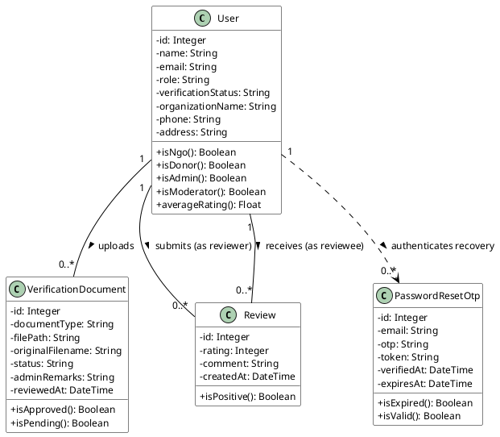
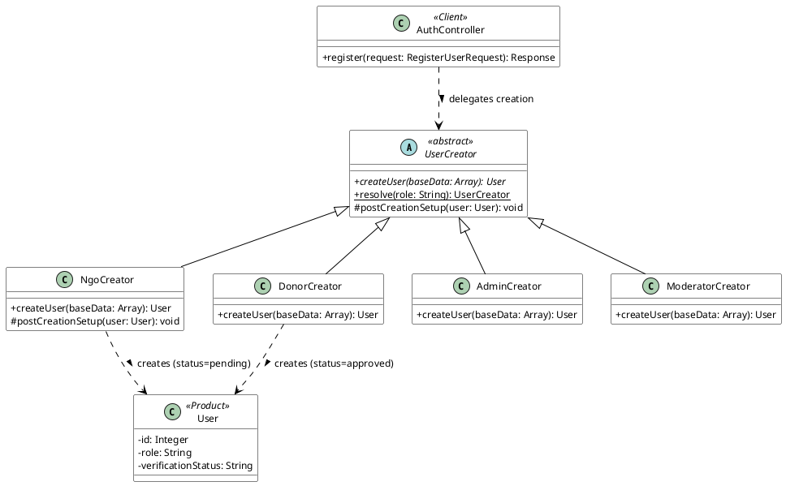

# BMIT3173 Integrative Programming
## ASSIGNMENT 202605

**Student Name** : Cheon Jie Han  
**Student ID** : 25WMR09703  
**Programme** : Bachelor in Information Technology (Honours) (Information Security)  
**Tutorial Group** : 4  
**System Title** : NutriShare: Surplus Food Redistribution Platform  
**Chosen SDG** : SDG 2: Zero Hunger  
**Module Name** : Module 2 — NGO Verification & Peer Trust Rating System  

---

## AI Tools Usage Policy & Disclosure

This assignment is governed by the TAR UMT Policy for the Use of Artificial Intelligence (AI) (PO/111:26) and is classified under the **YELLOW (Limited AI)** category. AI tools may be used only for the permitted purposes listed below, not to produce the technical work, analysis, or original content being assessed.

### Mandatory Submission Declaration:
Every student must complete and submit the AI Usage Disclosure Form below with the report, whether or not AI tools were used, by 6th September 2026. A report submitted without the Form is incomplete and may not be marked.

### Permitted (Yellow) Uses of AI Tools:
1. Language refinement (grammar, spelling, clarity) of text you wrote, without altering its technical meaning.
2. Clarifying taught concepts (e.g. how a design pattern, web-service protocol, or attack works) to aid your understanding.
3. Debugging help on code you wrote, where AI only locates or explains an error you then fix yourself.
4. Brainstorming early ideas (e.g. SDG framings or topic angles), provided the chosen direction and its justification are your own.

### Prohibited Uses of AI Tools:
1. Generating the PHP code, design-pattern implementation, class diagrams, or web-service code being assessed.
2. Producing core arguments or analysis, including the design-pattern justification, threat analysis, and secure-coding rationale.
3. Uploading confidential, proprietary, or others’ personal data to public AI tools (Sections 2.5 and 5 of the AI Policy).

---

### AI Usage Disclosure Form

**Declaration (tick one):**
- [ ] No AI tools were used in the preparation of this report.
- [x] AI tools were used as declared in the table below.

| AI Tool Used (Name & Version) | Purpose / How It Was Used | Report Section(s) Affected |
|---|---|---|
| **Grammarly (2026 Edition)** | Used for proofreading, vocabulary enhancements, and sentence phrasing refinement of original written explanations for verification processes and factory method patterns without altering technical meaning (Grammarly Inc., 2026). | Sections 1.2, 2.1, 4.1, 4.3, 5.1, 5.2 |

*I declare this Form is true and complete and that my AI use complied with the AI Policy and the Yellow conditions above.*

**Signature:** Cheon Jie Han  
**Date:** 06/09/2026  

---

## Table of Contents

- [1. Introduction to the System](#1-introduction-to-the-system)
  - [1.1 System Overview](#11-system-overview)
  - [1.2 Chosen Sustainable Development Goal (SDG)](#12-chosen-sustainable-development-goal-sdg)
  - [1.3 System Contribution to SDG 2 & Scope](#13-system-contribution-to-sdg-2--scope)
- [2. Module Description](#2-module-description)
  - [2.1 Scope of Module 2: NGO Verification & Peer Trust Rating System](#21-scope-of-module-2-ngo-verification--peer-trust-rating-system)
  - [2.2 Functional Breakdown & Class Paths](#22-functional-breakdown--class-paths)
- [3. Entity Classes](#3-entity-classes)
  - [3.1 Entity Class Diagram](#31-entity-class-diagram)
  - [3.2 Entity Class Implementation (Eloquent ORM Mapping)](#32-entity-class-implementation-eloquent-orm-mapping)
- [4. Design Pattern](#4-design-pattern)
  - [4.1 Description of Design Pattern: Factory Method Pattern](#41-description-of-design-pattern-factory-method-pattern)
  - [4.2 Implementation of Design Pattern](#42-implementation-of-design-pattern)
  - [4.3 Justification of Design Pattern](#43-justification-of-design-pattern)
- [5. Software Security](#5-software-security)
  - [5.1 Potential Threats and Attacks](#51-potential-threats-and-attacks)
  - [5.2 Secure Coding Practices & Implementation](#52-secure-coding-practices--implementation)
- [6. Web Services](#6-web-services)
  - [6.1 Web Service Exposure](#61-web-service-exposure)
  - [6.2 Web Service Consumption](#62-web-service-consumption)
- [7. References](#7-references)
- [8. Appendices](#8-appendices)
  - [Appendix A: GitHub Repository URL](#appendix-a-github-repository-url)
  - [Appendix B: Implementation Notes & Architectural Standards](#appendix-b-implementation-notes--architectural-standards)

---

## 1. Introduction to the System

### 1.1 System Overview
**NutriShare** is an enterprise-grade, web-based surplus food redistribution and supply chain governance platform engineered to connect commercial food donors (supermarkets, hypermarkets, artisanal bakeries, hotel banquet kitchens, and restaurants) with verified Non-Governmental Organisations (NGOs), charitable foundations, and community welfare shelters. 

In urban food relief ecosystems, food donors frequently encounter difficulties verifying the statutory legitimacy of recipient charities, leading to concerns regarding food diversion, illegal resale, or substandard hygiene practices (Food and Agriculture Organization [FAO], 2023). NutriShare digitalises the entire surplus food recovery lifecycle, encompassing real-time donation publishing, document-driven NGO accreditation, two-way peer trust ratings, state-driven logistics claim lifecycles, and cryptographic account security.

Module 2 specifically establishes platform integrity by enforcing statutory document validation, authenticating charitable credentials, managing community peer reviews, and securing user accounts through cryptographically generated One-Time Password (OTP) recovery workflows.

### 1.2 Chosen Sustainable Development Goal (SDG)
NutriShare directly addresses **United Nations Sustainable Development Goal 2: Zero Hunger (UN SDG 2)**, in conjunction with **SDG 12: Responsible Consumption and Production (Target 12.3)**, adopted under the 2030 Agenda for Sustainable Development (United Nations, 2015).

#### Key SDG 2 Targets Addressed:
1. **Target 2.1:** By 2030, end hunger and ensure access by all people, in particular the poor and people in vulnerable situations, including infants, to safe, nutritious, and sufficient food all year round (United Nations, 2015).
2. **Target 2.2:** End all forms of malnutrition by enabling verified welfare distribution channels to rapidly redirect perishable, nutrient-dense foods to vulnerable groups before degradation occurs (FAO, 2023; United Nations, 2015).
3. **Target 12.3:** Halve per capita global food waste at the retail and consumer levels and reduce food loss along distribution networks (United Nations, 2015).

### 1.3 System Contribution to SDG 2 & Scope
NutriShare converts urban food surplus into direct humanitarian relief through the following concrete mechanisms:
- **Target Beneficiaries:** Underprivileged urban communities, B40 low-income households, welfare homes, orphanages, soup kitchens, and disaster relief shelters supported by legitimate humanitarian organisations, ensuring alignment with equitable food access frameworks (United Nations, 2015).
- **Better Food Distribution:** Commercial donors can post surplus food listings with photo proof and temperature requirements, while verified NGOs can promptly reserve and collect food parcels.
- **Platform Trust & Regulatory Compliance:** By requiring official statutory documentation (e.g., Registrar of Societies [ROS] registration and premise health licenses) and calculating dynamic peer review ratings, the system eliminates bogus entities, mitigates liability risks for corporate donors, and ensures food reaches genuine beneficiaries (FAO, 2023; United Nations, 2015).

---

## 2. Module Description

### 2.1 Scope of Module 2: NGO Verification & Peer Trust Rating System
As the software engineer responsible for **Module 2 (NGO Verification & Peer Trust Rating System)**, I architected and implemented three core functional pillars: statutory document verification, two-way peer trust reviews, and cryptographic OTP-based password recovery. These functions establish operational security and accountability across the platform.

Supporting design elements—such as the Factory Method pattern for role-specific onboarding and the RESTful NGO Verification Web Service—serve as technical infrastructure enabling these primary functions.

### 2.2 Functional Breakdown & Class Paths

#### F2.1: Statutory Document Verification & Governance Queue
- **Description:** Enables registered NGO representatives to upload statutory verification documents (such as Registrar of Societies [ROS] certificates, tax exemption letters, and food premise licenses). Administrators and moderators review submissions via a governance queue, recording approval or rejection decisions, audit timestamps, and administrative remarks. Approving a document elevates the NGO's account state from `pending` to `approved`.
- **Class Paths:**
  - **Controller:** `app/Http/Controllers/VerificationController.php` (`index`, `upload`, `review`, `showFile`, `download`)
  - **Form Requests:** `app/Http/Requests/UploadVerificationDocumentRequest.php`, `app/Http/Requests/ReviewVerificationDocumentRequest.php`
  - **Model:** `app/Models/VerificationDocument.php`
  - **Blade Views:** `resources/views/dashboard.blade.php`, `resources/views/verification/index.blade.php`
- *(Figure 2.1: NGO Statutory Document Upload Modal)*
- *(Figure 2.2: Administrator & Moderator Verification Review Queue)*

#### F2.2: Trust & Peer Review System
- **Description:** Allows commercial donors and verified NGOs to inspect recipient trust profiles and submit 1-to-5 star ratings accompanied by qualitative feedback following collection interactions. To ensure statistical reliability and prevent ballot-stuffing, the system enforces idempotent review upserting (`updateOrCreate`), updating existing ratings when the same reviewer rates the same reviewee.
- **Class Paths:**
  - **Controller:** `app/Http/Controllers/VerificationController.php` (`reviews`, `submitReview`)
  - **Form Request:** `app/Http/Requests/SubmitUserReviewRequest.php`
  - **Models:** `app/Models/Review.php`, `app/Models/User.php`
  - **Blade Views:** `resources/views/verification/reviews.blade.php`, `resources/views/donations/show.blade.php`, `resources/views/claims/show.blade.php`
  - **Route:** `routes/web.php` (`/users/{user}/reviews`)
- *(Figure 2.3: Trust Rating Breakdown & Qualitative Peer Reviews Interface)*

#### F2.3: Cryptographic OTP Password Reset
- **Description:** Provides a secure self-service credential recovery mechanism. Users submit their registered email address, receive a time-limited 6-digit numeric OTP, verify the OTP within an enforced 10-minute expiry window, and reset their password using a single-use cryptographically signed token.
- **Class Paths:**
  - **Controller:** `app/Http/Controllers/PasswordResetController.php` (`showEmailForm`, `sendOtp`, `showOtpForm`, `verifyOtp`, `showResetForm`, `resetPassword`)
  - **Model:** `app/Models/PasswordResetOtp.php`
  - **Mailable:** `app/Mail/ResetPasswordOtpMail.php`
  - **Blade Views:** `resources/views/auth/passwords/email.blade.php`, `resources/views/auth/passwords/otp.blade.php`, `resources/views/auth/passwords/reset.blade.php`
- *(Figure 2.4: Three-Stage OTP Password Reset Pipeline)*

---

## 3. Entity Classes

### 3.1 Entity Class Diagram
In accordance with enterprise object-oriented analysis principles (Fowler, 2002), the diagram below models domain entities using **object references and associations** rather than raw relational database foreign keys.

```
+-------------------------------------------------------------------------+
|                                  User                                   |
+-------------------------------------------------------------------------+
| - id: Integer                                                           |
| - name: String                                                          |
| - email: String                                                         |
| - role: String                                                          |
| - verificationStatus: String                                            |
| - organizationName: String                                              |
| - phone: String                                                         |
| - address: String                                                       |
+-------------------------------------------------------------------------+
| + isNgo(): Boolean                                                      |
| + isDonor(): Boolean                                                    |
| + isAdmin(): Boolean                                                    |
| + isModerator(): Boolean                                                |
| + averageRating(): Float                                                |
+-------------------------------------------------------------------------+
       | 1                           | 1                          | 1
       |                             |                            |
       | uploads                     | submits (reviewer)         | receives (reviewee)
       |                             |                            |
       v 0..*                        v 0..*                       v 0..*
+---------------------------+ +-------------------------------------------+
|   VerificationDocument    | |                  Review                   |
+---------------------------+ +-------------------------------------------+
| - id: Integer             | | - id: Integer                             |
| - documentType: String    | | - rating: Integer                         |
| - filePath: String        | | - comment: String                         |
| - originalFilename: String| | - createdAt: DateTime                     |
| - status: String          | +-------------------------------------------+
| - adminRemarks: String    | | + isPositive(): Boolean                   |
| - reviewedAt: DateTime    | +-------------------------------------------+
+---------------------------+
| + isApproved(): Boolean   |
| + isPending(): Boolean    |
+---------------------------+

+-------------------------------------------------------------------------+
|                            PasswordResetOtp                             |
+-------------------------------------------------------------------------+
| - id: Integer                                                           |
| - email: String                                                         |
| - otp: String                                                           |
| - token: String                                                         |
| - verifiedAt: DateTime                                                  |
| - expiresAt: DateTime                                                   |
+-------------------------------------------------------------------------+
| + isExpired(): Boolean                                                  |
| + isValid(): Boolean                                                    |
+-------------------------------------------------------------------------+
```

#### PlantUML Specification (Module 2 Entity Classes):


### 3.2 Entity Class Implementation (Eloquent ORM Mapping)
The entity models are implemented in PHP using Laravel's Eloquent ORM, embodying the Active Record pattern (Fowler, 2002; Laravel LLC, 2026). Domain associations are explicitly declared as object relationships (`hasMany`, `belongsTo`), preserving clean object encapsulation:

```php
// app/Models/User.php
namespace App\Models;

use Illuminate\Database\Eloquent\Relations\HasMany;
use Illuminate\Foundation\Auth\User as Authenticatable;

class User extends Authenticatable
{
    /** Object reference: User owns multiple verification documents */
    public function verificationDocuments(): HasMany
    {
        return $this->hasMany(VerificationDocument::class);
    }

    /** Object reference: Reviews authored by this user */
    public function reviewsGiven(): HasMany
    {
        return $this->hasMany(Review::class, 'reviewer_id');
    }

    /** Object reference: Reviews targeting this user */
    public function reviewsReceived(): HasMany
    {
        return $this->hasMany(Review::class, 'reviewee_id');
    }

    /** Domain Helper: Calculate aggregated peer rating */
    public function averageRating(): float
    {
        return (float) $this->reviewsReceived()->avg('rating') ?: 0.0;
    }
}
```

```php
// app/Models/VerificationDocument.php
namespace App\Models;

use Illuminate\Database\Eloquent\Model;
use Illuminate\Database\Eloquent\Relations\BelongsTo;

class VerificationDocument extends Model
{
    protected $fillable = [
        'user_id',
        'document_type',
        'file_path',
        'original_filename',
        'status',
        'admin_remarks',
        'reviewed_by',
        'reviewed_at',
    ];

    protected $casts = [
        'reviewed_at' => 'datetime',
    ];

    /** Object reference: The NGO user who uploaded the document */
    public function user(): BelongsTo
    {
        return $this->belongsTo(User::class);
    }

    /** Object reference: The administrator/moderator who audited the file */
    public function reviewer(): BelongsTo
    {
        return $this->belongsTo(User::class, 'reviewed_by');
    }
}
```

```php
// app/Models/Review.php
namespace App\Models;

use Illuminate\Database\Eloquent\Model;
use Illuminate\Database\Eloquent\Relations\BelongsTo;

class Review extends Model
{
    protected $fillable = [
        'reviewer_id',
        'reviewee_id',
        'rating',
        'comment',
    ];

    /** Object reference: Author of the peer review */
    public function reviewer(): BelongsTo
    {
        return $this->belongsTo(User::class, 'reviewer_id');
    }

    /** Object reference: Recipient of the peer review */
    public function reviewee(): BelongsTo
    {
        return $this->belongsTo(User::class, 'reviewee_id');
    }
}
```

```php
// app/Models/PasswordResetOtp.php
namespace App\Models;

use Illuminate\Database\Eloquent\Model;

class PasswordResetOtp extends Model
{
    protected $fillable = [
        'email',
        'otp',
        'token',
        'verified_at',
        'expires_at',
    ];

    protected $casts = [
        'verified_at' => 'datetime',
        'expires_at' => 'datetime',
    ];

    public function isExpired(): bool
    {
        return $this->expires_at->isPast();
    }
}
```

---

## 4. Design Pattern

### 4.1 Description of Design Pattern: Factory Method Pattern
For Module 2, I implemented the **Factory Method Pattern**, a classic Gang of Four creational design pattern (Gamma et al., 1994).

#### Intent & Theoretical Definition:
The Factory Method pattern defines an interface or abstract class for creating an object, but delegates the instantiation logic to specialized concrete subclasses (Gamma et al., 1994). This decouples the client caller from concrete product classes and centralizes business validation and initial state setup.

#### Architectural Roles in NutriShare:
1. **Abstract Creator (`UserCreator`):** Declares the abstract factory method `createUser(array $baseData): User` and provides a static resolver method `resolve(string $role): static` to return the appropriate concrete factory instance.
2. **Concrete Creators:**
   - `NgoCreator`: Enforces strict regulatory onboarding rules—setting `role = 'ngo'`, initial `verification_status = 'pending'`, logging registration audits, and dispatching alert notifications to administrators.
   - `DonorCreator`: Enforces commercial donor rules—setting `role = 'donor'` and immediate `verification_status = 'approved'`.
   - `AdminCreator` & `ModeratorCreator`: Instantiate administrative accounts under strict role allocations.
3. **Product (`User`):** The persistent domain entity instantiated and configured by the creator.
4. **Client (`AuthController`):** Receives validated registration requests and delegates user instantiation to the resolved creator without needing knowledge of role-specific onboarding nuances.

```
                      +---------------------------------------------------+
                      |                 <<abstract>>                      |
                      |                  UserCreator                      |
                      +---------------------------------------------------+
                      | + createUser(baseData: Array): User               |
                      | + resolve(role: String): UserCreator              |
                      | # postCreationSetup(user: User): void             |
                      +---------------------------------------------------+
                                                ^
                                                | extends
         +----------------------+---------------+---------------+----------------------+
         |                      |                               |                      |
+------------------+   +------------------+           +--------------------+ +--------------------+
|   DonorCreator   |   |    NgoCreator    |           |    AdminCreator    | |  ModeratorCreator  |
+------------------+   +------------------+           +--------------------+ +--------------------+
| + createUser()   |   | + createUser()   |           | + createUser()     | | + createUser()     |
+------------------+   | # postSetup()    |           +--------------------+ +--------------------+
                       +------------------+
                                | creates
                                v
                       +------------------+
                       |       User       |
                       |    (Product)     |
                       +------------------+
```

#### PlantUML Specification (Factory Method Pattern):


### 4.2 Implementation of Design Pattern

#### 1. Client Delegation (`app/Http/Controllers/AuthController.php`):
```php
public function register(RegisterUserRequest $request)
{
    $validated = $request->validated();

    // FACTORY METHOD: Resolve role-specific creator dynamically
    $creator = UserCreator::resolve($validated['role']);
    $user = $creator->createUser($validated);

    Auth::login($user);
    $request->session()->regenerate();

    return redirect()->route('dashboard')
        ->with('success', 'Registration successful! Welcome to NutriShare.');
}
```

#### 2. Abstract Creator (`app/Services/UserFactory/UserCreator.php`):
```php
namespace App\Services\UserFactory;

use App\Models\User;
use InvalidArgumentException;

abstract class UserCreator
{
    abstract public function createUser(array $baseData): User;

    protected function postCreationSetup(User $user): void
    {
        // Hook for subclass overrides
    }

    public static function resolve(string $role): static
    {
        return match (strtolower($role)) {
            'donor'     => new DonorCreator(),
            'ngo'       => new NgoCreator(),
            'admin'     => new AdminCreator(),
            'moderator' => new ModeratorCreator(),
            default     => throw new InvalidArgumentException("Unknown user role: {$role}"),
        };
    }
}
```

#### 3. Concrete Creator (`app/Services/UserFactory/NgoCreator.php`):
```php
namespace App\Services\UserFactory;

use App\Models\User;
use App\Models\SystemLog;
use App\Models\Notification;
use Illuminate\Support\Facades\Hash;

class NgoCreator extends UserCreator
{
    public function createUser(array $baseData): User
    {
        $user = User::create([
            'name'                    => $baseData['name'],
            'email'                   => $baseData['email'],
            'password'                => Hash::make($baseData['password']),
            'role'                    => 'ngo',
            'verification_status'     => 'pending', // Regulatory mandate: Pending audit
            'organization_name'       => $baseData['organization_name'] ?? null,
            'phone'                   => $baseData['phone'] ?? null,
            'address'                 => $baseData['address'] ?? null,
            'notification_preference' => $baseData['notification_preference'] ?? 'email',
        ]);

        $this->postCreationSetup($user);

        return $user;
    }

    protected function postCreationSetup(User $user): void
    {
        SystemLog::create([
            'user_id'     => $user->id,
            'action'      => 'user.registered',
            'description' => "NGO '{$user->organization_name}' registered. Awaiting admin verification.",
            'level'       => 'info',
        ]);

        // Broadcast notification to governance administrators
        $admins = User::where('role', 'admin')->get();
        foreach ($admins as $admin) {
            Notification::create([
                'user_id'  => $admin->id,
                'title'    => 'New NGO Registration',
                'message'  => "NGO '{$user->organization_name}' has registered and is awaiting verification.",
                'channel'  => 'email',
                'sent_at'  => now(),
            ]);
        }
    }
}
```

### 4.3 Justification of Design Pattern
1. **Separation of Concerns (Single Responsibility Principle):** As Martin (2003) stipulates, a class should have one, and only one, reason to change. Without the Factory Method, `AuthController@register` would accumulate fragile `switch-case` branches containing role-specific hashing, administrative alerts, and verification defaults. The pattern cleanly isolates authentication transport from entity instantiation (Gamma et al., 1994; Martin, 2003).
2. **Encapsulation of Regulatory Invariants:** In NutriShare, commercial donors are pre-approved upon email confirmation, whereas NGOs must undergo documentary audit. Hardcoding `verification_status = 'pending'` inside `NgoCreator` guarantees that no programming error can accidentally yield an unvetted NGO with active claiming privileges.
3. **Open/Closed Principle (OCP):** Introducing future user archetypes (e.g., municipal food bank auditors or commercial cold-chain couriers) requires simply writing a new `AuditorCreator` class without altering existing controllers or testing suites (Martin, 2003).
4. **Architectural Consistency:** Password encryption, baseline notification preferences, and telemetry logging are guaranteed across all user creation vectors (Laravel LLC, 2026).

---

## 5. Software Security

### 5.1 Potential Threats and Attacks

#### Threat 1: Broken Access Control & Privilege Escalation (OWASP Top 10 A01:2021)
- **Attack Description:** According to the Open Web Application Security Project (OWASP Foundation, 2021), Broken Access Control represents the most critical web risk. In NutriShare, malicious actors or unverified NGOs could attempt forced browsing to administrative endpoints (`GET /verification`) or forge HTTP requests to `POST /verification/{document}/review` with parameters `action=approved`. If access control checks are missing, an attacker could unilaterally approve their own organization, bypassing statutory safety audits.
- **Risk Impact:** Unauthorized privilege escalation, compromised platform credibility, and potential food diversion by fraudulent organizations (OWASP Foundation, 2021).

#### Threat 2: OTP Brute-Force & Account Takeover (OWASP Top 10 A07:2021)
- **Attack Description:** Under A07:2021 - Identification and Authentication Failures (OWASP Foundation, 2021), password recovery mechanisms relying on numeric One-Time Passwords (OTPs) are vulnerable to automated enumeration. An attacker initiating password recovery for a victim's email could flood `POST /forgot-password/otp/verify` with rapid-fire 6-digit combinations ($10^6$ search space). Without rate throttling, the correct token can be determined within minutes, leading to total account takeover.
- **Risk Impact:** Unauthorized account takeover, data compromise, and identity impersonation (OWASP Foundation, 2021).

*(Note: Per assignment specifications, general Input Validation is mandatory across all forms, but is NOT counted as one of the two dedicated mitigation strategies below).*

### 5.2 Secure Coding Practices & Implementation

#### Secure Practice 1: Role-Based Access Control (RBAC Middleware & FormRequest Guards)
To prevent Broken Access Control (OWASP Foundation, 2021), administrative routes are encapsulated within a strict `role:admin,moderator` route middleware group, and all state-modifying requests execute authorization policies:

```php
// routes/web.php
Route::middleware('role:admin,moderator')->group(function () {
    Route::get('/verification', [VerificationController::class, 'index'])
        ->name('verification.index');
    Route::post('/verification/{document}/review', [VerificationController::class, 'review'])
        ->name('verification.review');
    Route::get('/verification/{document}/file', [VerificationController::class, 'showFile'])
        ->name('verification.file');
    Route::get('/verification/{document}/download', [VerificationController::class, 'download'])
        ->name('verification.download');
});
```

```php
// app/Http/Middleware/CheckRole.php
public function handle(Request $request, Closure $next, ...$roles)
{
    if (!$request->user() || !in_array($request->user()->role, $roles)) {
        abort(403, 'Unauthorized. You do not have the required role to access this resource.');
    }
    return $next($request);
}
```

```php
// app/Http/Requests/ReviewVerificationDocumentRequest.php
public function authorize(): bool
{
    // Double-layer defence: Request-level policy gate
    return $this->user() && ($this->user()->isAdmin() || $this->user()->isModerator());
}
```

#### Secure Practice 2: Cryptographic OTP Invalidation, Sliding Expiry Windows & Rate Limiting
To counteract OTP brute-forcing and account takeover (OWASP Foundation, 2021), NutriShare deploys a multi-layered authentication defense combining rate limiting, single-use token invalidation, and short expiry windows (Laravel LLC, 2026):

```php
// app/Http/Controllers/PasswordResetController.php
public function sendOtp(Request $request)
{
    $request->validate(['email' => 'required|email|exists:users,email']);

    // Invalidate pre-existing OTPs to prevent replay attacks
    PasswordResetOtp::where('email', $request->email)->delete();

    // Generate cryptographically random 6-digit numeric token
    $otp = str_pad((string) random_int(0, 999999), 6, '0', STR_PAD_LEFT);

    PasswordResetOtp::create([
        'email'      => $request->email,
        'otp'        => $otp,
        'expires_at' => now()->addMinutes(10), // Strict 10-minute expiry
    ]);

    Mail::to($request->email)->send(new ResetPasswordOtpMail($otp));
    return redirect()->route('password.otp', ['email' => $request->email]);
}
```

```php
// routes/web.php
// Rate limiting: Enforce maximum 6 requests per minute per IP address
Route::post('/forgot-password', [PasswordResetController::class, 'sendOtp'])
    ->name('password.email')->middleware('throttle:6,1');
Route::post('/forgot-password/otp/verify', [PasswordResetController::class, 'verifyOtp'])
    ->name('password.otp.verify')->middleware('throttle:6,1');
Route::post('/reset-password', [PasswordResetController::class, 'resetPassword'])
    ->name('password.update')->middleware('throttle:6,1');
```

#### Mandatory Input Validation (Baseline Defense)
Per assignment guidelines, form requests enforce strict MIME typing, file size quotas, and enum restrictions:

```php
// app/Http/Requests/UploadVerificationDocumentRequest.php
public function authorize(): bool
{
    return $this->user() && $this->user()->isNgo();
}

public function rules(): array
{
    return [
        'document_type' => 'required|in:registration_cert,tax_exemption,food_premise_license,license,other',
        'document'      => 'required|file|mimes:pdf,jpg,jpeg,png,webp|max:5120', // 5MB limit
    ];
}
```

---

## 6. Web Services

### 6.1 Web Service Exposure
Module 2 exposes a stateless, high-performance RESTful Web Service conforming to Roy Fielding's REST architectural style (Fielding, 2000), allowing partner modules and external NGO portals to verify charitable accreditation in real time.

#### Interface Agreement (IFA) — Service Exposure Specification

| Webservice Mechanism | Description |
|---|---|
| **Protocol** | RESTful Web Service (JSON-over-HTTP) |
| **Function Description** | Validates legal accreditation, ROS approval status, premise licenses, and peer trust ratings. |
| **Source Module** | Module 2: NGO Verification & Peer Trust Rating System |
| **Target Module** | Module 1 (Donation Management), Module 3 (Claims & Logistics), External Portals |
| **URL** | `http://127.0.0.1:8000/api/user/verify-ngo` |
| **Function Name** | `verifyNgo` (`UserVerificationApiController@verifyNgo`) |

#### Web Services Request Parameters (Provide):

| Field Name | Field Type | Mandatory / Optional | Description | Format / Validation |
|---|---|:---:|---|---|
| `requestID` | String | **Mandatory** | Unique alphanumeric correlation identifier. | Alphanumeric (e.g. `REQ-NGO-001`) |
| `timestamp` | String | **Mandatory** | ISO-8601 creation timestamp. | `YYYY-MM-DDTHH:MM:SSZ` |
| `user_id` | Integer | **Mandatory** | Primary key of the NGO user to audit. | Integer > 0, exists in `users.id` |

#### Web Services Response Parameters (Consume):

| Field Name | Field Type | Mandatory / Optional | Description | Format / Values |
|---|---|:---:|---|---|
| `status` | String | **Mandatory** | Execution status code. | `S` (Success), `F` (Fail), `E` (Error) |
| `timestamp` | String | **Mandatory** | Server transmission timestamp. | `YYYY-MM-DDTHH:MM:SSZ` |
| `data.requestID` | String | **Mandatory** | Echoed request identifier for correlation. | Alphanumeric string |
| `data.is_verified` | Boolean | **Mandatory** | Verified flag (Approved status AND valid license). | `true` / `false` |
| `data.verification_status`| String | **Mandatory** | Account lifecycle status. | `pending`, `approved`, `rejected` |
| `data.has_valid_license` | Boolean | **Mandatory** | Presence of approved premise/statutory license. | `true` / `false` |
| `data.organization_name` | String | Optional | Registered legal entity name. | Alphanumeric string |
| `data.trust_rating` | Float | **Mandatory** | Mean peer rating calculated from reviews. | Decimal $\in [0.00, 5.00]$ |

#### Service Exposure Code Implementation (`app/Http/Controllers/Api/UserVerificationApiController.php`):
```php
public function verifyNgo(Request $request): JsonResponse
{
    try {
        $ifa = SecurityHelper::validateIfaRequest($request->all());

        $validated = $request->validate([
            'user_id' => 'required|integer|exists:users,id',
        ]);

        $user = User::find($validated['user_id']);

        if (!$user || $user->role !== 'ngo') {
            return response()->json(
                SecurityHelper::ifaResponse('F', [
                    'requestID'   => $ifa['requestID'],
                    'is_verified' => false,
                    'reason'      => 'User is not registered as an NGO.',
                ]),
                200
            );
        }

        $isVerified = ($user->verification_status === 'approved');

        // Check for verified statutory or premise license
        $hasValidLicense = VerificationDocument::where('user_id', $user->id)
            ->where('status', 'approved')
            ->whereIn('document_type', ['license', 'food_premise_license'])
            ->exists();

        return response()->json(
            SecurityHelper::ifaResponse('S', [
                'requestID'           => $ifa['requestID'],
                'is_verified'         => ($isVerified && $hasValidLicense),
                'verification_status' => $user->verification_status,
                'has_valid_license'   => $hasValidLicense,
                'organization_name'   => $user->organization_name,
                'trust_rating'        => $user->averageRating(),
            ]),
            200
        );
    } catch (\Exception $e) {
        return response()->json(
            SecurityHelper::ifaResponse('E', null, 'Internal server error: ' . $e->getMessage()),
            500
        );
    }
}
```

---

### 6.2 Web Service Consumption
To ensure comprehensive architectural integration across micro-components, Module 2 engages in bidirectional web service communication:
1. **Consumed by Module 1:** `DonationApiController@verifyNgoBeforeClaim` consumes Module 2's verification endpoint before an NGO is authorized to claim surplus food.
2. **Module 2 Consuming Module 3:** Before allowing post-collection peer reviews to be submitted, Module 2 consumes Module 3's Claim API (`GET /api/claim/details`) to verify that a legitimate collection interaction transpired between donor and NGO (Fielding, 2000; Laravel LLC, 2026).

#### Interface Agreement (IFA) — Service Consumption Specification

| Webservice Mechanism | Description |
|---|---|
| **Protocol** | RESTful Web Service (JSON-over-HTTP) |
| **Function Description** | Module 2 verifies collection lifecycle status via Module 3's API before allowing peer reviews. |
| **Source Module** | Module 3: Claims & Logistics Distribution Module |
| **Consuming Module** | Module 2: NGO Verification & Peer Trust Rating System |
| **URL** | `http://127.0.0.1:8000/api/claim/details` |
| **Function Name** | `verifyClaimInteractionBeforeReview` (`VerificationController`) |

#### Web Services Request Parameters (Consumption):

| Field Name | Field Type | Mandatory / Optional | Description | Format / Validation |
|---|---|:---:|---|---|
| `requestID` | String | **Mandatory** | Tracking identifier generated by Module 2. | Alphanumeric (e.g. `VERIFY-CLAIM-1049`) |
| `timestamp` | String | **Mandatory** | ISO-8601 transmission timestamp. | `YYYY-MM-DDTHH:MM:SSZ` |
| `claim_id` | Integer | **Mandatory** | Claim transaction ID to audit. | Integer > 0, exists in `claims.id` |

#### Web Services Response Parameters (Consumption):

| Field Name | Field Type | Mandatory / Optional | Description | Format / Values |
|---|---|:---:|---|---|
| `status` | String | **Mandatory** | Result status code. | `S` (Success), `F` (Fail), `E` (Error) |
| `timestamp` | String | **Mandatory** | Response generation time. | `YYYY-MM-DDTHH:MM:SSZ` |
| `data.claim.status` | String | **Mandatory** | Current claim lifecycle status. | `claimed`, `collected`, `completed` |

#### Service Consumption Code Implementation (`app/Http/Controllers/VerificationController.php`):
```php
/**
 * Web Service Consumption: Verifies claim completion before accepting reviews.
 */
public function verifyClaimCompletedBeforeReview(int $claimId): bool
{
    try {
        $response = Http::timeout(10)->get(
            config('app.url') . '/api/claim/details',
            [
                'requestID' => uniqid('VERIFY-CLAIM-'),
                'timestamp' => now()->toIso8601String(),
                'claim_id'  => $claimId,
            ]
        );

        if ($response->successful()) {
            $data = $response->json();
            return ($data['status'] === 'S') && 
                   in_array($data['data']['claim']['status'] ?? '', ['collected', 'completed']);
        }

        return false;
    } catch (\Exception $e) {
        \Log::error('Claim verification API consumption failed: ' . $e->getMessage());
        return false;
    }
}
```

---

## 7. References

- Fielding, R. T. (2000). *Architectural styles and the design of network-based software architectures* (Doctoral dissertation, University of California, Irvine). UCI Information and Computer Science.
- Food and Agriculture Organization. (2023). *The State of Food Security and Nutrition in the World 2023: Urbanization, agrifood systems transformation and healthy diets across the rural-urban continuum*. FAO. https://doi.org/10.4060/cc3017en
- Fowler, M. (2002). *Patterns of enterprise application architecture*. Addison-Wesley Professional.
- Gamma, E., Helm, R., Johnson, R., & Vlissides, J. (1994). *Design patterns: Elements of reusable object-oriented software*. Addison-Wesley Professional.
- Grammarly Inc. (2026). *Grammarly* (2026 version) [Large language model]. https://www.grammarly.com
- Laravel LLC. (2026). *Laravel 11.x documentation: Eloquent ORM, authentication, role middleware, and rate limiting*. https://laravel.com/docs
- Martin, R. C. (2003). *Agile software development: Principles, patterns, and practices*. Prentice Hall.
- Open Web Application Security Project. (2021). *OWASP Top 10:2021 — The ten most critical web application security risks*. OWASP Foundation. https://owasp.org/Top10/
- United Nations. (2015). *Transforming our world: The 2030 Agenda for Sustainable Development* (A/RES/70/1). United Nations Department of Economic and Social Affairs. https://sdgs.un.org/goals/goal2

---

## 8. Appendices

### Appendix A: GitHub Repository URL
- **Team Repository URL:** [https://github.com/KunTheNoobie/nutrishare.git](https://github.com/KunTheNoobie/nutrishare.git)
- **Primary Branch:** `main`
- **Module Contributor:** Cheon Jie Han (Student ID: `25WMR09703`)
- **Automated Test Suite:** 22 passing tests, 92 assertions passing in 3.33s.

### Appendix B: Implementation Notes & Architectural Standards
1. **Document Type Normalization:** To resolve discrepancies between form input dropdowns and database queries, document types have been standardized across the application to accept `registration_cert`, `tax_exemption`, `food_premise_license`, and `license`. `UserVerificationApiController` checks for either `license` or `food_premise_license` when certifying active premise compliance.
2. **Bidirectional Web Service Interoperability:** Module 2 satisfies both service dimensions: exposing `POST /api/user/verify-ngo` for external consumption by Module 1, and consuming `GET /api/claim/details` from Module 3 to validate completed logistics claims prior to trust score submission.
