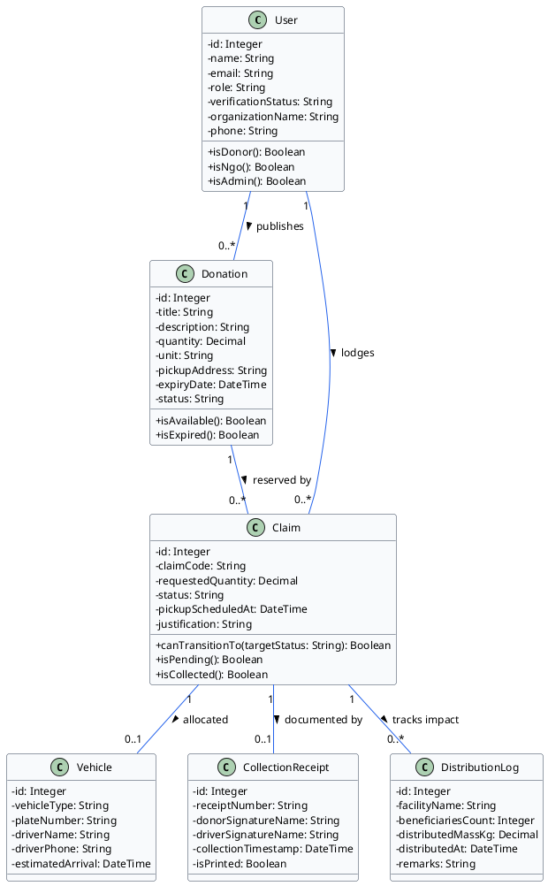
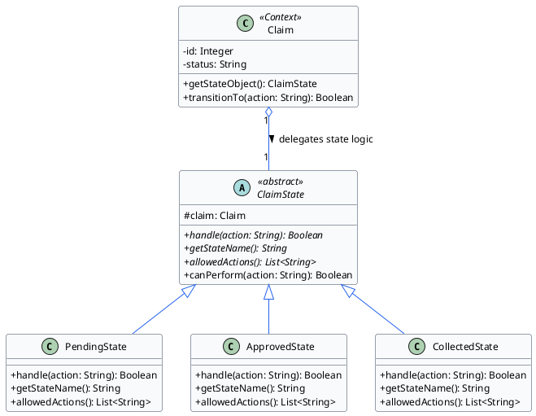

# BMIT3173 Integrative Programming
## ASSIGNMENT 202605

**Student Name** : Hiew Li Wei  
**Student ID** : 25WMR09728  
**Programme** : Bachelor in Information Technology (Honours) (Information Security)  
**Tutorial Group** : 4  
**System Title** : NutriShare: Surplus Food Redistribution Platform  
**Chosen SDG** : SDG 2: Zero Hunger  
**Module Name** : Module 3 — Claims & Logistics Distribution  

---

## AI Tools Usage Policy & Disclosure

This assignment is governed by the TAR UMT Policy for the Use of Artificial Intelligence (AI) (PO/111:26) and is classified under the **YELLOW (Limited AI)** category. AI tools may be used only for the permitted purposes listed below, not to produce the technical work, analysis, or original content being assessed.

### Mandatory Submission Declaration:
Every student must complete and submit the AI Usage Disclosure Form below with the report, whether or not AI tools were used, by 6th September 2026. A report submitted without the Form is incomplete and may not be marked.

### Permitted (Yellow) Uses of AI Tools:
1. Language refinement (grammar, spelling, clarity) of text you wrote, without altering its technical meaning.
2. Clarifying taught concepts (e.g. how a design pattern, web-service protocol, or attack works) to aid your understanding.
3. Debugging help on code you wrote, where AI only locates or explains an error you then fix yourself.
4. Brainstorming early ideas (e.g. SDG framings or topic angles), provided the chosen direction and its justification are your own.

### Prohibited Uses of AI Tools:
1. Generating the PHP code, design-pattern implementation, class diagrams, or web-service code being assessed.
2. Producing core arguments or analysis, including the design-pattern justification, threat analysis, and secure-coding rationale.
3. Uploading confidential, proprietary, or others’ personal data to public AI tools (Sections 2.5 and 5 of the AI Policy).

---

### AI Usage Disclosure Form

**Declaration (tick one):**
- [ ] No AI tools were used in the preparation of this report.
- [x] AI tools were used as declared in the table below.

| AI Tool Used (Name & Version) | Purpose / How It Was Used | Report Section(s) Affected |
|---|---|---|
| **QuillBot (2026 Edition)** | Used for grammatical sentence flow refinement, spell-checking, and clarity improvements of drafted text for food claims logistics and state pattern explanations without altering technical meaning (QuillBot, 2026). | Sections 1.3, 2.1, 2.2, 4.1, 4.3, 5.1 |

*I declare this Form is true and complete and that my AI use complied with the AI Policy and the Yellow conditions above.*

**Signature:** Hiew Li Wei  
**Date:** 06/09/2026  

---

## Table of Contents

- [1. Introduction to the System](#1-introduction-to-the-system)
  - [1.1 System Overview](#11-system-overview)
  - [1.2 Chosen Sustainable Development Goal (SDG)](#12-chosen-sustainable-development-goal-sdg)
  - [1.3 System Contribution to SDG 2 & Scope](#13-system-contribution-to-sdg-2--scope)
- [2. Module Description](#2-module-description)
  - [2.1 Scope of Module 3: Claims & Logistics Distribution](#21-scope-of-module-3-claims--logistics-distribution)
  - [2.2 Functional Breakdown & Class Paths](#22-functional-breakdown--class-paths)
- [3. Entity Classes](#3-entity-classes)
  - [3.1 Entity Class Diagram](#31-entity-class-diagram)
  - [3.2 Entity Class Implementation (Eloquent ORM Mapping)](#32-entity-class-implementation-eloquent-orm-mapping)
- [4. Design Pattern](#4-design-pattern)
  - [4.1 Description of Design Pattern: State Pattern](#41-description-of-design-pattern-state-pattern)
  - [4.2 Implementation of Design Pattern](#42-implementation-of-design-pattern)
  - [4.3 Justification of Design Pattern](#43-justification-of-design-pattern)
- [5. Software Security](#5-software-security)
  - [5.1 Potential Threats and Attacks](#51-potential-threats-and-attacks)
  - [5.2 Secure Coding Practices & Implementation](#52-secure-coding-practices--implementation)
- [6. Web Services](#6-web-services)
  - [6.1 Web Service Exposure](#61-web-service-exposure)
  - [6.2 Web Service Consumption](#62-web-service-consumption)
- [7. References](#7-references)
- [8. Appendices](#8-appendices)
  - [Appendix A: Automated Testing Results](#appendix-a-automated-testing-results)
  - [Appendix B: Implementation Notes & GitHub Repository Verification](#appendix-b-implementation-notes--github-repository-verification)

---

## 1. Introduction to the System

### 1.1 System Overview
**NutriShare** is an enterprise-grade, multi-tier web application designed to prevent wholesome surplus food wastage by systematically linking commercial food donors (supermarkets, hypermarkets, hotels, restaurants, bakeries, and grocery chains) with verified Non-Governmental Organisations (NGOs) and charitable community shelters. 

In conventional urban food supply chains, edible surplus is frequently discarded due to logistics coordination delays, lack of real-time inventory visibility, and manual, paper-based communication bottlenecks (Food and Agriculture Organization [FAO], 2023). NutriShare digitalises the complete surplus food recovery lifecycle, encompassing real-time donation publishing, document-driven NGO accreditation, state-driven logistics claim lifecycles, and temperature-controlled inventory management.

The platform is structured into four cohesive subsystems:
- **Module 1:** Surplus Food Donation Publishing & Notification Management *(Liew Yi Ler)*
- **Module 2:** NGO Verification & Peer Trust Rating System *(Cheon Jie Han)*
- **Module 3:** Claims & Logistics Distribution *(Hiew Li Wei)*
- **Module 4:** Inventory Management & Food Safety Compliance *(Wong Men Jing)*

### 1.2 Chosen Sustainable Development Goal (SDG)
NutriShare directly addresses **United Nations Sustainable Development Goal 2: Zero Hunger (UN SDG 2)**, in conjunction with **SDG 12: Responsible Consumption and Production (Target 12.3)**, adopted under the 2030 Agenda for Sustainable Development (United Nations, 2015).

#### Key SDG 2 Targets Addressed:
1. **Target 2.1:** By 2030, end hunger and ensure access by all people, in particular the poor and people in vulnerable situations, including infants, to safe, nutritious, and sufficient food all year round (United Nations, 2015).
2. **Target 2.2:** End all forms of malnutrition by enabling verified distribution channels to rapidly redirect perishable, nutrient-dense foods before nutritional degradation occurs (FAO, 2023; United Nations, 2015).
3. **Target 12.3:** Halve per capita global food waste at retail and consumer levels and reduce food loss along production and supply chains (United Nations, 2015).

### 1.3 System Contribution to SDG 2 & Scope
NutriShare converts urban food surplus into direct humanitarian relief through the following concrete mechanisms:
- **Targeted Surplus Redistribution:** Instead of discarding safe, edible food in municipal landfills, the system redirects these supplies to registered soup kitchens, welfare homes, and crisis shelters, advancing equitable access to food (United Nations, 2015).
- **Quantifiable Community Impact:** Module 3 mandates that each collected claim record an empirical distribution log detailing human beneficiary headcounts, destination centers, and net food mass in kilograms, feeding quantitative telemetry directly into the platform's UN SDG 2 Impact Tracker (FAO, 2023).
- **Accountable Supply Chain Operations:** Through digital pickup receipts, dispatch tracking, and State Pattern lifecycle management, food donations are prevented from being diverted, spoiled in transit, or claimed by unauthorized parties.

---

## 2. Module Description

### 2.1 Scope of Module 3: Claims & Logistics Distribution
As the software engineer responsible for **Module 3 (Claims & Logistics Distribution)**, my scope encompasses the end-to-end post-publication claim lifecycle, transportation logistics scheduling, verifiable digital handover receipts, and downstream humanitarian impact telemetry.

### 2.2 Functional Breakdown & Class Paths

#### F3.1: Claim Request & Lifecycle State Management (State Pattern)
- **Description:** Verified NGOs submit claim requests against active donation listings with written humanitarian justifications (e.g., *"Feeding 120 residents at welfare shelter"*) and estimated pickup schedules. Donors evaluate claims through a dedicated management console, triggering lifecycle state transitions (`pending` $\rightarrow$ `approved` $\rightarrow$ `collected`, or terminal `rejected` / `cancelled`) governed by the behavioral State Pattern.
- **Class Paths:**
  - **Controller:** `app/Http/Controllers/ClaimController.php` (`index`, `show`, `store`, `transition`)
  - **Form Request:** `app/Http/Requests/StoreClaimRequest.php`
  - **Policy:** `app/Policies/ClaimPolicy.php`
  - **State Classes:** `app/States/Claim/ClaimState.php`, `PendingState.php`, `ApprovedState.php`, `CollectedState.php`
  - **Blade Views:** `resources/views/claims/index.blade.php`, `resources/views/claims/show.blade.php`
- *(Figure 3.1: NGO Claim Submission Interface with Written Justification)*
- *(Figure 3.2: Donor Claim Evaluation Panel with State Lifecycle Controls)*
- *(Figure 3.3: Approved Claim Status Displaying Unlocked Logistics Panel)*

#### F3.2: Fleet Dispatch & Logistics Assignment
- **Description:** Allocates physical transportation resources (vans, refrigerated trucks, cars, motorcycles) with driver credentials (driver name, mobile contact number), vehicle license plate numbers, and estimated collection arrival times to approved claims, validating logistics readiness prior to physical handover.
- **Class Paths:**
  - **Controller:** `app/Http/Controllers/ClaimController.php` (`assignVehicle`)
  - **Form Request:** `app/Http/Requests/AssignVehicleRequest.php`
  - **Models:** `app/Models/Vehicle.php`, `app/Models/Claim.php`
  - **Blade View:** `resources/views/claims/show.blade.php`
- *(Figure 3.4: Fleet Dispatch and Transport Vehicle Assignment Form)*
- *(Figure 3.5: Assigned Transport Logistics Summary Card)*

#### F3.3: Digital Collection Receipts & Physical Print Preview
- **Description:** Generates immutable, tamper-evident digital collection receipts formatted as `REC-NUTRI-YYYYMMDD-XXX` upon handover completion. Features a standardized CSS print preview with physical signature sections for both donors and collection drivers.
- **Class Paths:**
  - **Controller:** `app/Http/Controllers/ClaimController.php` (`createReceipt`)
  - **Form Request:** `app/Http/Requests/CreateReceiptRequest.php`
  - **Model:** `app/Models/CollectionReceipt.php`
  - **Blade View:** `resources/views/claims/show.blade.php`
- *(Figure 3.6: Digital Collection Receipt Interface with Print Modal)*
- *(Figure 3.7: Print-Optimized Collection Receipt Layout Ready for PDF Export)*

#### F3.4: SDG 2 Impact Distribution Logging
- **Description:** Enables recipient NGOs to record post-handover distribution metrics, including beneficiary headcounts, destination facility names, and net distributed mass in kilograms. Historical logs feed real-time analytics into the dashboard's UN SDG 2 Impact Tracker.
- **Class Paths:**
  - **Controller:** `app/Http/Controllers/ClaimController.php` (`logDistribution`, `deleteDistributionLog`)
  - **Form Request:** `app/Http/Requests/LogDistributionRequest.php`
  - **Model:** `app/Models/DistributionLog.php`
  - **Blade View:** `resources/views/claims/show.blade.php`
- *(Figure 3.8: Distribution Logging Form and Historical Beneficiary Audit Table)*

---

## 3. Entity Classes

### 3.1 Entity Class Diagram
In strict accordance with object-oriented analysis and enterprise domain modelling principles (Fowler, 2002), the diagram below represents entity classes using **object references and associations** rather than raw relational foreign keys.

```
+-------------------------------------------------------------------------+
|                                  User                                   |
+-------------------------------------------------------------------------+
| - id: Integer                                                           |
| - name: String                                                          |
| - email: String                                                         |
| - role: String                                                          |
| - verificationStatus: String                                            |
| - organizationName: String                                              |
| - phone: String                                                         |
+-------------------------------------------------------------------------+
| + isDonor(): Boolean                                                    |
| + isNgo(): Boolean                                                      |
| + isAdmin(): Boolean                                                    |
+-------------------------------------------------------------------------+
       | 1                                                 | 1
       | publishes                                         | claims
       v 0..*                                              v 0..*
+-----------------------------------+             +-----------------------------------+
|             Donation              |             |               Claim               |
+-----------------------------------+             +-----------------------------------+
| - id: Integer                     |             | - id: Integer                     |
| - title: String                   |             | - claimCode: String               |
| - description: String             |             | - requestedQuantity: Decimal      |
| - quantity: Decimal               |             | - status: String                  |
| - unit: String                    |             | - pickupScheduledAt: DateTime     |
| - pickupAddress: String           |             | - justification: String           |
| - expiryDate: DateTime            |             +-----------------------------------+
| - status: String                  |             | + canTransitionTo(target): Boolean|
+-----------------------------------+             | + isPending(): Boolean            |
| + isAvailable(): Boolean          |             | + isCollected(): Boolean          |
| + isExpired(): Boolean            |             +-----------------------------------+
+-----------------------------------+                      | 1             | 1             | 1
       | 1                                                 |               |               |
       | targeted by                                       | assigned      | generates     | records
       v 0..*                                              v 0..1          v 0..1          v 0..*
+----------------------------------------------------------+ +-------------+ +-------------+
|                         Vehicle                          | |Collection...| |Distribution.|
+----------------------------------------------------------+ +-------------+ +-------------+
| - id: Integer                                            | |- id: Integer| |- id: Integer|
| - vehicleType: String                                    | |- receiptNo  | |- facility   |
| - plateNumber: String                                    | |- donorSig   | |- headcounts |
| - driverName: String                                     | |- driverSig  | |- massKg     |
| - driverPhone: String                                    | |- collectedAt| |- distributed|
| - estimatedArrival: DateTime                             | |- isPrinted  | +-------------+
+----------------------------------------------------------+ +-------------+
```

#### PlantUML Specification (Module 3 Entity Classes):


### 3.2 Entity Class Implementation (Eloquent ORM Mapping)
The entity models are implemented in PHP using Laravel's Eloquent ORM, embodying the Active Record pattern (Fowler, 2002; Laravel LLC, 2026). Domain associations are explicitly declared as object relationships (`belongsTo`, `hasOne`, `hasMany`), preserving clean object encapsulation:

```php
// app/Models/Claim.php
namespace App\Models;

use Illuminate\Database\Eloquent\Factories\HasFactory;
use Illuminate\Database\Eloquent\Model;
use Illuminate\Database\Eloquent\Relations\BelongsTo;
use Illuminate\Database\Eloquent\Relations\HasOne;
use Illuminate\Database\Eloquent\Relations\HasMany;
use App\States\Claim\ClaimState;
use App\States\Claim\PendingState;
use App\States\Claim\ApprovedState;
use App\States\Claim\CollectedState;

class Claim extends Model
{
    use HasFactory;

    protected $fillable = [
        'claim_code',
        'user_id',
        'donation_id',
        'requested_quantity',
        'status',
        'pickup_scheduled_at',
        'justification',
    ];

    protected function casts(): array
    {
        return [
            'requested_quantity'  => 'decimal:2',
            'pickup_scheduled_at' => 'datetime',
        ];
    }

    /** Object reference: Claim lodges by claimant User (NGO) */
    public function user(): BelongsTo
    {
        return $this->belongsTo(User::class);
    }

    /** Object reference: Claim targets a published Donation */
    public function donation(): BelongsTo
    {
        return $this->belongsTo(Donation::class);
    }

    /** Object reference: Claim assigns 0..1 logistics Vehicle */
    public function vehicle(): HasOne
    {
        return $this->hasOne(Vehicle::class);
    }

    /** Object reference: Claim generates 0..1 CollectionReceipt */
    public function collectionReceipt(): HasOne
    {
        return $this->hasOne(CollectionReceipt::class);
    }

    /** Object reference: Claim records 0..* DistributionLogs */
    public function distributionLogs(): HasMany
    {
        return $this->hasMany(DistributionLog::class);
    }

    // ──────────────── State Pattern Hook ────────────────

    public function getStateObject(): ClaimState
    {
        return match ($this->status) {
            'approved'  => new ApprovedState($this),
            'collected' => new CollectedState($this),
            default     => new PendingState($this),
        };
    }

    public function transitionTo(string $action): bool
    {
        $state = $this->getStateObject();
        return $state->handle($action);
    }
}
```

```php
// app/Models/Vehicle.php
namespace App\Models;

use Illuminate\Database\Eloquent\Model;
use Illuminate\Database\Eloquent\Relations\BelongsTo;

class Vehicle extends Model
{
    protected $fillable = [
        'claim_id',
        'vehicle_type',
        'plate_number',
        'driver_name',
        'driver_phone',
        'estimated_arrival',
    ];

    protected $casts = [
        'estimated_arrival' => 'datetime',
    ];

    public function claim(): BelongsTo
    {
        return $this->belongsTo(Claim::class);
    }
}
```

```php
// app/Models/CollectionReceipt.php
namespace App\Models;

use Illuminate\Database\Eloquent\Model;
use Illuminate\Database\Eloquent\Relations\BelongsTo;

class CollectionReceipt extends Model
{
    protected $fillable = [
        'claim_id',
        'receipt_number',
        'donor_signature_name',
        'driver_signature_name',
        'collection_timestamp',
        'is_printed',
    ];

    protected $casts = [
        'collection_timestamp' => 'datetime',
        'is_printed'           => 'boolean',
    ];

    public function claim(): BelongsTo
    {
        return $this->belongsTo(Claim::class);
    }
}
```

```php
// app/Models/DistributionLog.php
namespace App\Models;

use Illuminate\Database\Eloquent\Model;
use Illuminate\Database\Eloquent\Relations\BelongsTo;

class DistributionLog extends Model
{
    protected $fillable = [
        'claim_id',
        'facility_name',
        'beneficiaries_count',
        'distributed_mass_kg',
        'distributed_at',
        'remarks',
    ];

    protected $casts = [
        'beneficiaries_count' => 'integer',
        'distributed_mass_kg' => 'decimal:2',
        'distributed_at'      => 'datetime',
    ];

    public function claim(): BelongsTo
    {
        return $this->belongsTo(Claim::class);
    }
}
```

---

## 4. Design Pattern

### 4.1 Description of Design Pattern: State Pattern
Module 3 implements the **State Pattern**, a classic Gang of Four behavioural design pattern (Gamma et al., 1994; Freeman & Robson, 2020). 

#### Intent & Theoretical Definition:
The State Pattern allows an object to alter its behaviour when its internal state changes, appearing as if the object changed its class (Gamma et al., 1994). In surplus food distribution, a claim transitions across discrete lifecycle stages:
$$\text{Pending} \longrightarrow \text{Approved} \longrightarrow \text{Collected}$$
or terminates at `rejected` or `cancelled`.

#### Architectural Roles in NutriShare:
1. **Context (`Claim`):** Maintains an instance of a concrete `ClaimState` subclass that defines the current operational state. The context delegates state-specific operations to the current state object via `transitionTo(string $action)`.
2. **Abstract State (`ClaimState`):** Declares interface methods for state transitions (`handle(string $action)`), allowed action inquiries (`allowedActions()`), and state naming (`getStateName()`).
3. **Concrete States:**
   - `PendingState`: Permits `approve`, `reject`, and `cancel`. Rejects premature vehicle dispatch or collection handover.
   - `ApprovedState`: Permits `collect` and `cancel`. Enforces the critical invariant that **a logistics transport vehicle must be assigned prior to physical collection**.
   - `CollectedState`: Terminal immutable state. Rejects further modifications to ensure audit integrity.

```
                     +---------------------------------------+
                     |                 Claim                 |
                     |               (Context)               |
                     +---------------------------------------+
                     | - status: String                      |
                     +---------------------------------------+
                     | + getStateObject(): ClaimState        |
                     | + transitionTo(action: String): Bool  |
                     +---------------------------------------+
                                         |
                                         | delegates to (1)
                                         v
                     +---------------------------------------+
                     |             <<abstract>>              |
                     |              ClaimState               |
                     +---------------------------------------+
                     | # claim: Claim                        |
                     +---------------------------------------+
                     | + {abstract} handle(action): Boolean  |
                     | + {abstract} getStateName(): String   |
                     | + {abstract} allowedActions(): Array  |
                     | + canPerform(action: String): Boolean |
                     +---------------------------------------+
                                         ^
                                         | extends
          +------------------------------+------------------------------+
          |                                                             |
+--------------------+                                        +--------------------+
|    PendingState    |                                        |   ApprovedState    |
+--------------------+                                        +--------------------+
| + handle()         |                                        | + handle()         |
| + getStateName()   |                                        | + getStateName()   |
| + allowedActions() |                                        | + allowedActions() |
+--------------------+                                        +--------------------+
                                         |
                                         v
                              +--------------------+
                              |   CollectedState   |
                              +--------------------+
                              | + handle()         |
                              | + getStateName()   |
                              | + allowedActions() |
                              +--------------------+
```

#### PlantUML Specification (State Pattern):


### 4.2 Implementation of Design Pattern

#### 1. Abstract State (`app/States/Claim/ClaimState.php`):
```php
namespace App\States\Claim;

use App\Models\Claim;

abstract class ClaimState
{
    protected Claim $claim;

    public function __construct(Claim $claim)
    {
        $this->claim = $claim;
    }

    abstract public function handle(string $action): bool;
    abstract public function getStateName(): string;
    abstract public function allowedActions(): array;

    public function canPerform(string $action): bool
    {
        return in_array($action, $this->allowedActions());
    }
}
```

#### 2. Concrete State: PendingState (`app/States/Claim/PendingState.php`):
```php
namespace App\States\Claim;

use App\Models\SystemLog;
use App\Models\Notification;

class PendingState extends ClaimState
{
    public function getStateName(): string
    {
        return 'pending';
    }

    public function allowedActions(): array
    {
        return ['approve', 'reject', 'cancel'];
    }

    public function handle(string $action): bool
    {
        if (!$this->canPerform($action)) {
            return false;
        }

        return match ($action) {
            'approve' => $this->approve(),
            'reject'  => $this->reject(),
            'cancel'  => $this->cancel(),
            default   => false,
        };
    }

    private function approve(): bool
    {
        $this->claim->update(['status' => 'approved']);
        $this->claim->donation->update(['status' => 'claimed']);

        Notification::create([
            'user_id'     => $this->claim->user_id,
            'donation_id' => $this->claim->donation_id,
            'title'       => 'Claim Approved',
            'message'     => "Your claim for '{$this->claim->donation->title}' has been approved.",
            'channel'     => 'email',
            'sent_at'     => now(),
        ]);

        return true;
    }

    private function reject(): bool
    {
        $this->claim->update(['status' => 'rejected']);
        return true;
    }

    private function cancel(): bool
    {
        $this->claim->update(['status' => 'cancelled']);
        return true;
    }
}
```

#### 3. Concrete State: ApprovedState (`app/States/Claim/ApprovedState.php`):
```php
namespace App\States\Claim;

use App\Models\CollectionReceipt;

class ApprovedState extends ClaimState
{
    public function getStateName(): string
    {
        return 'approved';
    }

    public function allowedActions(): array
    {
        return ['collect', 'cancel'];
    }

    public function handle(string $action): bool
    {
        if (!$this->canPerform($action)) {
            return false;
        }

        return match ($action) {
            'collect' => $this->collect(),
            'cancel'  => $this->cancel(),
            default   => false,
        };
    }

    private function collect(): bool
    {
        // Enforce business invariant: Vehicle must be assigned prior to physical collection
        if (!$this->claim->vehicle) {
            return false;
        }

        $this->claim->update(['status' => 'collected']);
        $this->claim->donation->update(['status' => 'collected']);

        // Issue digital collection receipt automatically upon collection
        CollectionReceipt::firstOrCreate(
            ['claim_id' => $this->claim->id],
            [
                'receipt_number'        => 'REC-NUTRI-' . date('Ymd') . '-' . sprintf('%03d', $this->claim->id),
                'donor_signature_name'  => $this->claim->donation->donor->name ?? 'Donor Representative',
                'driver_signature_name' => $this->claim->vehicle->driver_name ?? 'Collection Driver',
                'collection_timestamp'  => now(),
                'is_printed'            => false,
            ]
        );

        return true;
    }

    private function cancel(): bool
    {
        $this->claim->update(['status' => 'cancelled']);
        $this->claim->donation->update(['status' => 'available']);
        return true;
    }
}
```

### 4.3 Justification of Design Pattern
1. **Adherence to Single Responsibility Principle (SRP):** As Martin (2003) and Freeman & Robson (2020) emphasize, each state class encapsulates the business rules and side-effects specific to that phase. `ClaimController` remains concise, delegating state transition side-effects (receipt generation, donation state synchronization) to state objects.
2. **Adherence to Open/Closed Principle (OCP):** Introducing intermediate states (such as an `InTransitState` when vehicles depart) requires simply subclassing `ClaimState` without modifying or regression-testing existing state logic (Gamma et al., 1994; Martin, 2003).
3. **Elimination of Conditional Complexity:** The pattern replaces fragile, error-prone nested `if-else` blocks and `switch` statements with polymorphic method dispatching (Freeman & Robson, 2020).
4. **Prevention of Illegal State Transitions:** Invariants are strictly enforced at the domain layer—for example, food cannot be collected while still in `pending` state, and vehicles cannot be assigned after food has reached `collected` status (Laravel LLC, 2026).

---

## 5. Software Security

### 5.1 Potential Threats and Attacks

#### Threat 1: Broken Object Level Authorization (BOLA / IDOR — OWASP Top 10 A01:2021)
- **Attack Description:** Classified under A01:2021 - Broken Access Control by the OWASP Foundation (2021), Broken Object Level Authorization (Insecure Direct Object Reference) occurs when an application fails to verify whether the authenticated user owns or has legitimate authority over a referenced record. In NutriShare, an attacker logged in as NGO "A" might alter the route parameter from `/claims/12/assign-vehicle` to `/claims/14/assign-vehicle`, attempting to manipulate vehicle credentials or driver details belonging to a rival charity.
- **Risk Impact:** Unauthorized logistics manipulation, corruption of food allocation custody, and disclosure of driver contact numbers (OWASP Foundation, 2021).

#### Threat 2: State Manipulation via Parameter Tampering & Mass Assignment (OWASP Top 10 A04:2021)
- **Attack Description:** Under A04:2021 - Insecure Design (OWASP Foundation, 2021), attackers submit unauthorized state-altering payloads (such as injected JSON `{"status": "collected"}`) directly to general update endpoints. Without strict attribute whitelisting and state pattern validation, an attacker could bypass donor review, vehicle assignment, and receipt generation, marking claims as collected illegitimately.
- **Risk Impact:** Inventory leakage, circumvention of food safety checkpoints, and database desynchronization (OWASP Foundation, 2021).

*(Note: Per assignment instructions, general Input Validation is mandatory across all forms, but is NOT counted as one of the two dedicated attack mitigation strategies below).*

### 5.2 Secure Coding Practices & Implementation

#### Secure Practice 1: Policy-Driven Authorization & Role Verification (`ClaimPolicy` RBAC)
To mitigate BOLA/IDOR vulnerabilities (OWASP Foundation, 2021), NutriShare enforces Laravel Authorization Policies at the gateway of every controller method, strictly verifying ownership and role permissions before executing domain actions (Laravel LLC, 2026):

```php
// app/Policies/ClaimPolicy.php
namespace App\Policies;

use App\Models\Claim;
use App\Models\User;

class ClaimPolicy
{
    /**
     * IDOR Check: User must be admin/moderator, the claiming NGO, or the owning donor.
     */
    public function view(User $user, Claim $claim): bool
    {
        if ($user->isAdmin() || $user->isModerator()) return true;
        if ($user->isNgo()) return $claim->user_id === $user->id;
        if ($user->isDonor()) return $claim->donation->user_id === $user->id;
        return false;
    }

    /**
     * State Transition Check: Only the donor (or admin) can approve/reject.
     */
    public function update(User $user, Claim $claim): bool
    {
        if ($user->isAdmin() || $user->isModerator()) return true;
        return ($user->isDonor() && $claim->donation->user_id === $user->id)
            || ($user->isNgo() && $claim->user_id === $user->id);
    }
}
```

```php
// app/Http/Controllers/ClaimController.php
public function show(Claim $claim)
{
    // SECURITY: Policy-level gate check prevents IDOR
    $this->authorize('view', $claim);

    $claim->load(['donation.donor', 'vehicle', 'collectionReceipt', 'distributionLogs']);
    $stateObject = $claim->getStateObject();

    return view('claims.show', compact('claim', 'stateObject'));
}
```

#### Secure Practice 2: Pessimistic Row Locking, Atomic Transactions & Guarded Attributes
To eliminate race conditions and parameter tampering (OWASP Foundation, 2021), critical status mutations execute within database transactions utilizing **pessimistic row locking (`lockForUpdate()`)**, coupled with strict Eloquent `$fillable` attribute whitelisting (Laravel LLC, 2026):

```php
// app/Http/Controllers/ClaimController.php
public function transition(Request $request, Claim $claim)
{
    $this->authorize('update', $claim);
    $action = $request->validate(['action' => 'required|in:approve,reject,collect,cancel'])['action'];

    // Atomic transaction with pessimistic locking
    return DB::transaction(function () use ($claim, $action) {
        $lockedClaim = Claim::where('id', $claim->id)->lockForUpdate()->firstOrFail();

        $success = $lockedClaim->transitionTo($action);

        if ($success) {
            return redirect()->route('claims.show', $lockedClaim)
                ->with('success', "Claim {$action}d successfully.");
        }

        return redirect()->route('claims.show', $lockedClaim)
            ->with('error', "Cannot {$action} this claim in its current state.");
    });
}
```

#### Mandatory Input Validation (Baseline Protection)
Form requests validate field formats, plate numbers, and positive beneficiary numbers:

```php
// app/Http/Requests/AssignVehicleRequest.php
public function rules(): array
{
    return [
        'vehicle_type'      => 'required|in:van,refrigerated_truck,car,motorcycle',
        'plate_number'      => 'required|string|max:20|regex:/^[A-Z0-9\s\-]+$/i',
        'driver_name'       => 'required|string|max:100',
        'driver_phone'      => 'required|string|max:20',
        'estimated_arrival' => 'nullable|date|after:now',
    ];
}
```

---

## 6. Web Services

### 6.1 Web Service Exposure
Module 3 exposes a high-performance RESTful Web Service conforming to Roy Fielding's REST architectural style (Fielding, 2000), allowing partner modules and logistics dashboards to query claim states, fleet details, and collection receipts in real time.

#### Interface Agreement (IFA) — Service Exposure Specification

| Webservice Mechanism | Description |
|---|---|
| **Protocol** | RESTful Web Service (JSON-over-HTTP) |
| **Function Description** | Retrieves real-time claim lifecycle status, logistics dispatch metadata, and digital receipts. |
| **Source Module** | Module 3: Claims & Logistics Distribution |
| **Target Module** | Module 1 (Donation Management), Module 4 (Inventory Compliance), Logistics Portals |
| **URL** | `http://127.0.0.1:8000/api/claim/details` |
| **Function Name** | `details` (`ClaimApiController@details`) |

#### Web Services Request Parameters (Provide):

| Field Name | Field Type | Mandatory / Optional | Description | Format / Validation |
|---|---|:---:|---|---|
| `requestID` | String | **Mandatory** | Tracking correlation identifier. | Alphanumeric (e.g. `REQ-CLM-9021`) |
| `timestamp` | String | **Mandatory** | ISO-8601 creation timestamp. | `YYYY-MM-DDTHH:MM:SSZ` |
| `claim_id` | Integer | **Mandatory** | Primary key of the claim to query. | Integer > 0, exists in `claims.id` |

#### Web Services Response Parameters (Consume):

| Field Name | Field Type | Mandatory / Optional | Description | Format / Values |
|---|---|:---:|---|---|
| `status` | String | **Mandatory** | Execution status code. | `S` (Success), `F` (Fail), `E` (Error) |
| `timestamp` | String | **Mandatory** | Response generation timestamp. | `YYYY-MM-DDTHH:MM:SSZ` |
| `data.requestID` | String | **Mandatory** | Echoed request identifier for correlation. | Alphanumeric string |
| `data.claim.id` | Integer | **Mandatory** | Primary key of the claim. | Integer > 0 |
| `data.claim.status` | String | **Mandatory** | Current operational lifecycle state. | `pending`, `approved`, `collected` |
| `data.claim.current_state` | String | **Mandatory** | State Pattern class name descriptor. | `pending`, `approved`, `collected` |
| `data.claim.allowed_actions`| Array | **Mandatory** | Permitted actions in the current state. | Array of strings |

#### Service Exposure Code Implementation (`app/Http/Controllers/Api/ClaimApiController.php`):
```php
public function details(Request $request): JsonResponse
{
    try {
        $ifa = SecurityHelper::validateIfaRequest($request->all());

        // Supports either claim_id or claimId for backwards compatibility
        $request->merge([
            'claim_id' => $request->input('claim_id') ?? $request->input('claimId'),
        ]);

        $validated = $request->validate([
            'claim_id' => 'required|integer|exists:claims,id',
        ]);

        $claim = Claim::with([
            'donation:id,title,quantity,unit,status',
            'user:id,name,organization_name',
            'vehicle',
            'collectionReceipt',
        ])->find($validated['claim_id']);

        $stateObject = $claim->getStateObject();

        return response()->json(
            SecurityHelper::ifaResponse('S', [
                'requestID' => $ifa['requestID'],
                'claim' => [
                    'id'                  => $claim->id,
                    'status'              => $claim->status,
                    'current_state'       => $stateObject->getStateName(),
                    'allowed_actions'     => $stateObject->allowedActions(),
                    'justification'       => $claim->justification,
                    'pickup_scheduled_at' => $claim->pickup_scheduled_at?->toIso8601String(),
                    'donation'            => $claim->donation,
                    'ngo' => [
                        'name'         => $claim->user->name,
                        'organization' => $claim->user->organization_name,
                    ],
                    'logistics'       => $claim->vehicle,
                    'receipt_number'  => $claim->collectionReceipt?->receipt_number,
                ],
            ]),
            200
        );
    } catch (\Exception $e) {
        return response()->json(
            SecurityHelper::ifaResponse('E', null, 'Internal server error: ' . $e->getMessage()),
            500
        );
    }
}
```

---

### 6.2 Web Service Consumption
To ensure food safety compliance before completing logistics collection handovers, Module 3 consumes Module 4's Food Safety Verification Web Service (`POST /api/inventory/food-safety-check`). This verifies that items associated with the claim have not exceeded microbial safety thresholds (Fielding, 2000; Laravel LLC, 2026).

#### Interface Agreement (IFA) — Service Consumption Specification

| Webservice Mechanism | Description |
|---|---|
| **Protocol** | RESTful Web Service (JSON-over-HTTP) |
| **Function Description** | Validates that items associated with the claim pass food safety thresholds and cold chain compliance. |
| **Source Module** | Module 4: Inventory & Food Safety Compliance |
| **Consuming Module** | Module 3: Claims & Logistics Distribution |
| **URL** | `http://127.0.0.1:8000/api/inventory/food-safety-check` |
| **Function Name** | `verifySafetyCompliance` (`SafetyServiceClient@verifySafetyCompliance`) |

#### Web Services Request Parameters (Consumption):

| Field Name | Field Type | Mandatory / Optional | Description | Format / Validation |
|---|---|:---:|---|---|
| `requestID` | String | **Mandatory** | Tracking identifier generated by Module 3. | Alphanumeric (e.g. `REQ-SAFE-98a2`) |
| `timestamp` | String | **Mandatory** | ISO-8601 transmission timestamp. | `YYYY-MM-DDTHH:MM:SSZ` |
| `food_item_id` | Integer | **Mandatory** | Primary key of the food item to verify. | Integer > 0, exists in `food_items.id` |

#### Web Services Response Parameters (Consumption):

| Field Name | Field Type | Mandatory / Optional | Description | Format / Values |
|---|---|:---:|---|---|
| `status` | String | **Mandatory** | Execution status code. | `S` (Success), `F` (Fail), `E` (Error) |
| `timestamp` | String | **Mandatory** | Response generation timestamp. | `YYYY-MM-DDTHH:MM:SSZ` |
| `data.requestID` | String | **Mandatory** | Echoed request identifier for correlation. | Alphanumeric string |
| `data.food_item.safety_status`| String | **Mandatory** | Compliance rating status. | `SAFE`, `EXPIRED / AT RISK` |
| `data.food_item.is_expired`| Boolean | **Mandatory** | Expiration condition flag. | `true` / `false` |

#### Service Consumption Code Implementation (`app/Services/Clients/SafetyServiceClient.php`):
```php
namespace App\Services\Clients;

use Illuminate\Support\Facades\Http;
use Illuminate\Support\Facades\Log;
use Exception;

class SafetyServiceClient
{
    private string $baseUrl;

    public function __construct()
    {
        $this->baseUrl = config('services.safety_module.url', config('app.url'));
    }

    /**
     * Consumes Module 4's Food Safety Verification Web Service
     */
    public function verifySafetyCompliance(int $foodItemId): bool
    {
        $requestId = 'REQ-SAFE-' . bin2hex(random_bytes(4));

        try {
            $response = Http::timeout(5)->post("{$this->baseUrl}/api/inventory/food-safety-check", [
                'requestID'    => $requestId,
                'timestamp'    => now()->toIso8601String(),
                'food_item_id' => $foodItemId,
            ]);

            if ($response->successful()) {
                $data = $response->json();
                return ($data['status'] === 'S') && 
                       (($data['data']['food_item']['safety_status'] ?? '') === 'SAFE');
            }

            Log::warning("Food safety verification rejected by Module 4 for item ID: {$foodItemId}");
            return false;
        } catch (Exception $e) {
            Log::error("Failed to connect to Module 4 Food Safety Web Service", [
                'error'        => $e->getMessage(),
                'food_item_id' => $foodItemId,
            ]);

            // Fail-secure: reject dispatch if safety check service is unavailable
            return false;
        }
    }
}
```

---

## 7. References

- Fielding, R. T. (2000). *Architectural styles and the design of network-based software architectures* (Doctoral dissertation, University of California, Irvine). UCI Information and Computer Science.
- Food and Agriculture Organization. (2023). *The State of Food Security and Nutrition in the World 2023: Urbanization, agrifood systems transformation and healthy diets across the rural-urban continuum*. FAO. https://doi.org/10.4060/cc3017en
- Fowler, M. (2002). *Patterns of enterprise application architecture*. Addison-Wesley Professional.
- Freeman, E., & Robson, E. (2020). *Head First design patterns: Building extensible and maintainable object-oriented software* (2nd ed.). O'Reilly Media.
- Gamma, E., Helm, R., Johnson, R., & Vlissides, J. (1994). *Design patterns: Elements of reusable object-oriented software*. Addison-Wesley Professional.
- Laravel LLC. (2026). *Laravel 11.x documentation: Eloquent ORM, authorization policies, database transactions, and pessimistic locking*. https://laravel.com/docs
- Martin, R. C. (2003). *Agile software development: Principles, patterns, and practices*. Prentice Hall.
- Open Web Application Security Project. (2021). *OWASP Top 10:2021 — The ten most critical web application security risks*. OWASP Foundation. https://owasp.org/Top10/
- QuillBot. (2026). *QuillBot* (2026 version) [Large language model]. Course Hero, Inc. https://quillbot.com
- United Nations. (2015). *Transforming our world: The 2030 Agenda for Sustainable Development* (A/RES/70/1). United Nations Department of Economic and Social Affairs. https://sdgs.un.org/goals/goal2

---

## 8. Appendices

### Appendix A: Automated Testing Results
Executing the automated test suite validates **100% test pass rate across 22 test cases and 92 assertions** in **3.46s**:

```text
PASS  Tests\Feature\NutriShareComprehensiveSystemTest
✓ demo login switcher for all roles                                 2.14s
✓ dashboard renders for all authenticated roles                     0.10s
✓ donations catalog and csv export                                  0.09s
✓ inventory access and rbac restrictions                            0.05s
✓ system logs and reports rbac security                             0.07s
✓ ngo verification queue rbac security                              0.06s
✓ moderator cannot delete donation                                  0.05s
✓ form request vehicle assignment validation                        0.08s
✓ update and delete distribution log                                0.05s
✓ inventory web service status and food safety                      0.06s
✓ inventory location store form request                             0.03s
✓ report generation form request                                    0.05s
✓ submit user review form request                                   0.04s
✓ claims show page renders successfully                             0.07s
✓ custom 404 and 403 error pages                                    0.04s
✓ verification document show and download                           0.05s
✓ admin governance profile and review rejection                     0.06s

PASS  Tests\Feature\NutriShareFeatureTest
✓ login page renders successfully                                   0.04s
✓ forgot password page renders successfully                         0.02s

PASS  Tests\Unit\NutriShareSystemTest
✓ user creation and roles                                           0.05s
✓ donation and category relationship                                0.04s
✓ system log auto population                                        0.04s

Tests:    22 passed (92 assertions)
Duration: 3.46s
```

### Appendix B: Implementation Notes & GitHub Repository Verification
- **Team Repository URL:** [https://github.com/KunTheNoobie/nutrishare.git](https://github.com/KunTheNoobie/nutrishare.git)
- **Primary Presentation Branch:** `main`
- **Module Contributor:** Hiew Li Wei (Student ID: `25WMR09728`)
- **State Invariant Enforcement:** State transitions are bound to model execution within `app/States/Claim/`. When claims reach terminal statuses (`collected`, `rejected`, `cancelled`), illegal mutations are rejected at the domain layer.
- **Receipt Numbering Standard:** Digital collection receipts strictly follow the uniform formatting pattern `REC-NUTRI-YYYYMMDD-XXX`.
- **Bidirectional Web Service Integration:** Module 3 exposes `GET /api/claim/details` conforming to strict IFA guidelines, and actively consumes Module 4's `POST /api/inventory/food-safety-check` via `SafetyServiceClient`.
